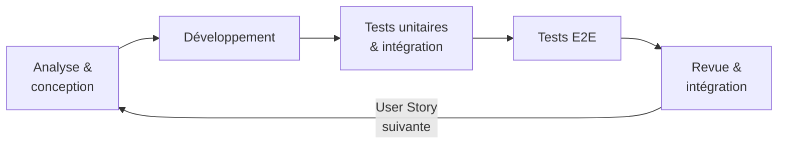
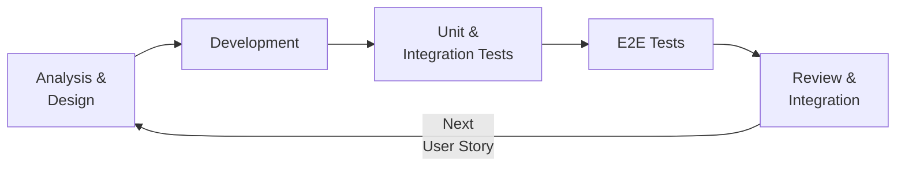

# Site E-commerce
## Conçu avec une méthode d'ingénierie système MBSE / Built with Model-Based Engineering Method

## Table of Contents / Sommaire

<table border="0">
<tr>
<td valign="top">

### 🇫🇷 Français
- [Introduction](#introduction-)
- [1. Rédaction du document d'architecture](#1-rédaction-du-document-darchitecture)
- [2. Mise en place de l'infrastructure](#2-mise-en-place-de-linfrastructure-de-la-solution)
- [3. Développement itératif](#3-développement-des-cas-dutilisation-de-manière-itérative)

</td>
<td valign="top">

### 🇬🇧 English
- [Introduction](#introduction-)
- [1. Writing the Architecture Document](#1-writing-the-architecture-document)
- [2. Setting Up the Infrastructure](#2-setting-up-the-solution-infrastructure)
- [3. Iterative Development](#3-iterative-development-of-use-cases)

</td>
</tr>
</table>

---

## Introduction 🇫🇷

Le projet a pour objectif de développer un site e-commerce dans l'état de l'art actuel, aussi bien en terme de technologie que de cybersécurité, en suivant un processus éprouvé d'ingénierie logicielle basée sur les modèles ([IDM](https://fr.wikipedia.org/wiki/Ing%C3%A9nierie_dirig%C3%A9e_par_les_mod%C3%A8les)). Il débute par la rédaction d'un [document d'architecture](architecture/Boutique%20en%20ligne%20-%20Documentation%20d%27Architecture.pdf) à partir des [exigences](architecture/Boutique%20en%20ligne%20-%20Exigences%20d%27utilisateurs.pdf) avant de passer au développement de la solution logicielle concrète.

> **Note :** La solution suit dans les grandes lignes les **recommandations de sécurité de l'[ANSSI](https://www.ssi.gouv.fr/)**, notamment le guide [authentification multifacteur et mots de passe](https://messervices.cyber.gouv.fr/guides/recommandations-relatives-lauthentification-multifacteur-et-aux-mots-de-passe) et le guide [sécurité des sites web](https://cyber.gouv.fr/guide-sites-web). Ces recommandations sont déclinées des exigences, jusqu'au code source de la solution, en passant par les documents d'architecture.

Un site e-commerce n'est pas le cas d'usage le plus représentatif pour une méthode issue du génie logiciel industriel — mais c'est précisément ce qui en fait un exemple intéressant : démontrer que la démarche s'adapte à tout type de projet, y compris web. Elle présente également un avantage concret dans le contexte actuel : disposer d'une architecture documentée et structurée permet de cadrer efficacement la génération de code par une IA, en lui fournissant un contexte précis et des contraintes claires plutôt que de partir d'une page blanche. L'approche consiste à modéliser, documenter et valider entièrement le système avant de commencer les développements. Issue du génie logiciel industriel, elle permet de détecter les incohérences et les ambiguïtés en amont, là où elles coûtent le moins cher à corriger. Cette démarche peut très bien prendre en compte de nouvelles exigences en cours de développement, à condition qu'elles repassent par l'ensemble du processus de conception afin de maintenir la documentation d'architecture à jour, et identifier d'éventuels problèmes pour les intégrer.

L'architecture système est modélisée selon une approche que l'on pourrait appeler **MBSE no tool** — appliquer la méthode [ARCADIA](https://fr.wikipedia.org/wiki/Arcadia_(ing%C3%A9nierie)) ([MBSE](https://fr.wikipedia.org/wiki/Ing%C3%A9nierie_syst%C3%A8me_bas%C3%A9e_sur_les_mod%C3%A8les) - Model-Based System Engineering) sans recourir à des outils puissants mais lourds tels qu'IBM Rhapsody, Enterprise Architect ou Capella, et sans engendrer de surcoût — ni en licences, ni en outillage, ni en courbe d'apprentissage. La stack retenue est volontairement légère : [AsciiDoc](https://asciidoc.org) pour la rédaction du document d'architecture, [PlantUML](https://plantuml.com) pour tous les diagrammes [UML](https://fr.wikipedia.org/wiki/UML_(informatique)) en notation textuelle versionnée avec le code, et [Git](https://git-scm.com) pour la gestion de version. Ces formats textuels présentent deux avantages complémentaires : les modifications de l'architecture sont directement lisibles dans une pull request, comme n'importe quel changement de code — contrairement aux modèles binaires des outils MBSE traditionnels, impossibles à relire ou à commenter dans une revue de code Git — et une IA agentique peut les lire, les analyser et les produire nativement. À partir du document des exigences, elle assiste l'ingénieur pour construire les différentes vues ARCADIA avec leurs diagrammes UML, et propage tout changement d'exigence à travers toute la chaîne — architecture, diagrammes, code — sans rupture de traçabilité.

L'absence d'outil MBSE dédié est aussi une liberté : sans contrainte logicielle, la méthode peut être appliquée à la carte — en ne retenant que les niveaux d'analyse et les diagrammes réellement utiles au contexte du projet, plutôt que de suivre la démarche dans son intégralité par obligation.

Le processus global se déroule en trois phases séquentielles et interdépendantes :

- **Rédaction du document d'architecture** — Le besoin utilisateur est analysé en profondeur selon la méthode [ARCADIA](https://fr.wikipedia.org/wiki/Arcadia_(ing%C3%A9nierie)), du contexte opérationnel jusqu'à l'architecture physique de déploiement. Ce document constitue la référence technique et fonctionnelle de tout le projet.
- **Mise en place de l'infrastructure** — Les environnements (développement, gestion de version, production) sont configurés et validés avant le début du développement fonctionnel. Aucune User Story n'est implémentée tant que la plateforme de livraison n'est pas opérationnelle.
- **Développement itératif des cas d'utilisation** — Les fonctionnalités sont implémentées une par une, chacune suivant un cycle complet d'analyse, de développement, de tests et d'intégration. Chaque itération s'appuie sur l'architecture définie et laisse le système dans un état stable et livrable. Une fois toutes les fonctionnalités livrées, la documentation utilisateur est produite sur la base de l'application telle qu'elle a été livrée.

## 1. Rédaction du document d'architecture

Le document d'architecture est rédigé en suivant la méthodologie [ARCADIA](https://fr.wikipedia.org/wiki/Arcadia_(ing%C3%A9nierie)) (Architecture Analysis & Design Integrated Approach).

En voici les grandes phases d'analyse, qui représentent le besoin ou le système à des niveaux d'abstraction différents :

La méthode ARCADIA est suivie, dans cet exemple, en s'appuyant uniquement sur le langage de modélisation [UML](https://fr.wikipedia.org/wiki/UML_(informatique)). Le [document d'architecture](architecture/Boutique%20en%20ligne%20-%20Documentation%20d%27Architecture.pdf) est produit à partir du [**document des exigences utilisateurs**](architecture/Boutique%20en%20ligne%20-%20Exigences%20utilisateurs.pdf), qui constitue l'entrant formel de la démarche ARCADIA. Ce document recense les besoins opérationnels des acteurs (administrateur, vendeur, acheteur) ainsi que les exigences de sécurité issues des recommandations de l'ANSSI, et sert de référence tout au long des quatre niveaux d'analyse.

### Analyse du besoin

#### 1.1. Analyse du Besoin Opérationnel (OA — Operational Analysis)

Que font les utilisateurs et pourquoi ?
On modélise ici les acteurs (opérateurs, systèmes externes), leurs activités opérationnelles et les échanges entre eux, indépendamment de tout système à construire. On décrit le contexte métier réel.

**Exemple de diagramme OA — Cas d'utilisation opérationnel :**

#### 1.2. Analyse du Besoin Système (SA — System Need Analysis)

Que doit faire le système pour satisfaire ce besoin ?
On définit les fonctions du système vues de l'extérieur (ce qu'il doit accomplir), les interfaces avec les acteurs, et les scénarios d'usage. On reste volontairement agnostique sur l'architecture interne. Les exigences sont déduites de cette analyse fonctionnelle, et non l'inverse.

**Exemple de diagramme SA — Contexte système :**

### Analyse du système

#### 1.3. Architecture Logique (LA — Logical Architecture)

Comment organiser les fonctions en composants logiques ?
On décompose le système en composants logiques (sans préjuger des technologies) et on alloue les fonctions à ces composants. On travaille les flux d'échanges internes, la cohérence du découpage, et on identifie les premiers choix d'architecture. C'est le cœur de la conception système.

**Exemple de diagramme LA — Architecture logique des composants :**

#### 1.4. Architecture Physique (PA — Physical Architecture)

Quelles solutions concrètes implémentent l'architecture logique ?
On mappe les composants logiques sur des composants physiques réels (matériel, logiciel, réseaux). On gère les contraintes de déploiement, de performance, de redondance. On prépare la répartition du travail entre les parties prenantes.

**Exemple de diagramme PA — Architecture de déploiement :**

## 2. Mise en place de l'infrastructure de la solution

Une fois la solution documentée en détail, l'infrastructure de l'application est développée et déployée dans un environnement de test.

Cette phase comprend la configuration des environnements (développement, staging, production), la mise en place des outils [CI/CD](https://fr.wikipedia.org/wiki/CI/CD), ainsi que la définition et le provisionnement des ressources nécessaires (serveurs, bases de données, services cloud, etc.). L'infrastructure est validée par une série de tests techniques visant à garantir la stabilité, la disponibilité et la sécurité de la plateforme avant le début du développement fonctionnel.

## 3. Développement des cas d'utilisation de manière itérative

Les [cas d'utilisation](architecture/05-backlog/us.adoc) sont implémentés de manière itérative, l'un après l'autre, en suivant un cycle de développement structuré et reproductible.

Pour chaque User Story, le cycle suivant est appliqué dans son intégralité :

- **Analyse & conception** — prise en compte des exigences fonctionnelles définies dans le document d'architecture ; en cas de doute ou d'incohérence, mise au point avec l'utilisateur avant de poursuivre.
- **Développement** — implémentation du code source en respectant l'architecture définie.
- **Tests unitaires & d'intégration** — vérification du bon fonctionnement de chaque composant, isolément puis en interaction avec le reste du système.
- **Tests end-to-end (E2E)** — validation du parcours utilisateur complet, de bout en bout, afin de s'assurer que la fonctionnalité répond aux critères d'acceptation définis.
- **Revue & intégration** — validation finale et fusion dans la branche principale, avant de passer à la User Story suivante.

Cette approche garantit une livraison progressive et maîtrisée, tout en limitant les risques de régression au fil des itérations.

Une fois l'ensemble des cas d'utilisation développés et validés, la documentation utilisateur est produite sur la base de l'application telle qu'elle a été livrée. Elle comprend notamment :

- un guide utilisateur décrivant les principales fonctionnalités du site e-commerce (navigation, recherche de produits, gestion du panier, tunnel d'achat, suivi de commande, etc.) ;
- des guides pas à pas illustrant les parcours utilisateurs clés ;
- le cas échéant, une documentation administrateur à destination des gestionnaires de la boutique (gestion du catalogue, des commandes, des utilisateurs, etc.).

L'objectif est de fournir une documentation claire, accessible et maintenable, cohérente avec l'état final de l'application livrée.

---

## Introduction 🇬🇧

The project aims to develop an e-commerce website built to current best practices, in terms of both technology and cybersecurity, following a proven [model-driven](https://en.wikipedia.org/wiki/Model-driven_engineering) software engineering process. It begins with the writing of an [architecture document](architecture/Boutique%20en%20ligne%20-%20Documentation%20d%27Architecture.pdf) from the [requirements](architecture/Boutique%20en%20ligne%20-%20Exigences%20d%27utilisateurs.pdf), before moving on to the concrete development of the software solution.

> **Note:** The solution broadly follows **[ANSSI](https://www.ssi.gouv.fr/en/) security recommendations**, including the guide on [multi-factor authentication and passwords](https://messervices.cyber.gouv.fr/guides/recommandations-relatives-lauthentification-multifacteur-et-aux-mots-de-passe) and the [web security guide](https://cyber.gouv.fr/guide-sites-web). These recommendations are traced from the requirements down to the source code, through the architecture documents.

An e-commerce website is not the most representative use case for a method rooted in industrial software engineering — but that is precisely what makes it an interesting example: demonstrating that the approach adapts to any type of project, including web applications. It also offers a concrete advantage in today's context: having a documented and structured architecture makes it possible to effectively frame AI-assisted code generation, providing precise context and clear constraints rather than starting from a blank page. The approach consists of fully modelling, documenting and validating the system before any development begins. Rooted in industrial software engineering, it makes it possible to detect inconsistencies and ambiguities early — where they are least costly to fix. New requirements can very well be accommodated during development, provided they go through the full design process in order to keep the architecture documentation up to date and identify any issues before integrating them.

The system architecture is designed following an approach that could be called **MBSE no tool** — applying the [ARCADIA](https://en.wikipedia.org/wiki/Arcadia_(methodology)) method ([MBSE](https://en.wikipedia.org/wiki/Model-based_systems_engineering) - Model-Based System Engineering) without resorting to powerful but heavy tools such as IBM Rhapsody, Enterprise Architect or Capella, and without incurring additional costs — no licences, no heavy tooling, no steep learning curve. The chosen stack is deliberately lightweight: [AsciiDoc](https://asciidoc.org) for writing the architecture document, [PlantUML](https://plantuml.com) for all [UML](https://en.wikipedia.org/wiki/Unified_Modeling_Language) diagrams in text-based notation versioned alongside the code, and [Git](https://git-scm.com) for version control. Being text-based formats, they bring two complementary advantages: architecture changes are directly readable in a pull request, just like any code change — unlike the binary models produced by traditional MBSE tools, which are impossible to review or comment on in a code review — and an agentic AI can read, analyse and produce them natively. From the requirements document, it assists the engineer in building the various ARCADIA views with their UML diagrams, and propagates any requirement change across the entire chain — architecture, diagrams, code — with no break in traceability.

The absence of a dedicated MBSE tool is also a freedom: without software constraints, the method can be applied selectively — retaining only the analysis levels and diagrams that are genuinely useful for the project's context, rather than following the full process out of obligation.

The overall process unfolds across three sequential, interdependent phases:

- **Writing the architecture document** — The user requirements are analysed in depth using the [ARCADIA](https://en.wikipedia.org/wiki/Arcadia_(methodology)) method, from the operational context down to the physical deployment architecture. This document serves as the technical and functional reference for the entire project.
- **Setting up the infrastructure** — The environments (development, version control, production) and [CI/CD](https://en.wikipedia.org/wiki/CI/CD) tooling are configured and validated before any functional development begins. No User Story is implemented until the delivery platform is fully operational.
- **Iterative development of use cases** — Features are implemented one by one, each following a complete cycle of analysis, development, testing, and integration. Every iteration builds on the defined architecture and leaves the system in a stable, deliverable state. Once all features have been delivered, user documentation is produced based on the application as it has been delivered.

## 1. Writing the Architecture Document

The architecture document is written following the [ARCADIA](https://en.wikipedia.org/wiki/Arcadia_(methodology)) methodology (Architecture Analysis & Design Integrated Approach).

Here are the main analysis phases, each representing the need or the system at a different level of abstraction:

The ARCADIA method is followed in this example using exclusively [UML](https://en.wikipedia.org/wiki/Unified_Modeling_Language) modelling language. The [architecture document](architecture/Boutique%20en%20ligne%20-%20Documentation%20d%27Architecture.pdf) is produced from the [**user requirements document**](architecture/Boutique%20en%20ligne%20-%20Exigences%20utilisateurs.pdf), which constitutes the formal input to the ARCADIA process. This document captures the operational needs of all actors (administrator, vendor, buyer) as well as the security requirements derived from ANSSI recommendations, and serves as the reference throughout all four levels of analysis.

### Needs Analysis

#### 1.1. Operational Analysis (OA)

What do users do, and why?
This phase models the actors (operators, external systems), their operational activities, and the exchanges between them, independently of any system to be built. It describes the real business context.

**OA Diagram Example — Operational Use Case:**

#### 1.2. System Need Analysis (SA)

What must the system do to satisfy this need?
This phase defines the system's functions as seen from the outside (what it must accomplish), its interfaces with actors, and the usage scenarios. The internal architecture is deliberately left unspecified at this stage. Requirements are derived from this functional analysis — not the other way around.

**SA Diagram Example — System Context:**

### System Analysis

#### 1.3. Logical Architecture (LA)

How should functions be organised into logical components?
The system is broken down into logical components (without assuming any specific technology) and functions are allocated to those components. Internal exchange flows are defined, the decomposition is checked for consistency, and initial architectural decisions are made. This is the core of system design.

**LA Diagram Example — Logical Component Architecture:**

#### 1.4. Physical Architecture (PA)

Which concrete solutions implement the logical architecture?
Logical components are mapped onto real physical components (hardware, software, networks). Deployment, performance, and redundancy constraints are addressed, and the division of work between stakeholders is defined.

**PA Diagram Example — Deployment Architecture:**

## 2. Setting Up the Solution Infrastructure

Once the solution has been documented in detail, the application infrastructure is built and deployed in a test environment.

This phase covers the configuration of environments (development, staging, production), the setup of [CI/CD](https://en.wikipedia.org/wiki/CI/CD) tooling, and the provisioning of the required resources (servers, databases, cloud services, etc.). The infrastructure is validated through a series of technical tests to ensure the platform's stability, availability, and security prior to the start of functional development.

## 3. Iterative Development of Use Cases

[Use cases](architecture/05-backlog/us.adoc) are implemented one by one in an iterative manner, following a structured and repeatable development cycle.

For each User Story, the following cycle is applied in full:

- **Analysis & Design** — review of the functional requirements defined in the architecture document; any ambiguity or inconsistency is clarified with the stakeholder before proceeding.
- **Development** — implementation of the source code in compliance with the defined architecture.
- **Unit & Integration Testing** — verification that each component functions correctly in isolation and in interaction with the rest of the system.
- **End-to-End (E2E) Testing** — full validation of the user journey from start to finish, ensuring the feature meets the defined acceptance criteria.
- **Review & Integration** — final validation and merge into the main branch, before moving on to the next User Story.

This approach ensures progressive, controlled delivery while minimising the risk of regression across iterations.

Once all use cases have been developed and validated, user documentation is produced based on the application as it has been delivered. It includes in particular:

- a user guide describing the main features of the e-commerce website (browsing, product search, cart management, checkout flow, order tracking, etc.);
- step-by-step guides illustrating key user journeys;
- where applicable, an administrator guide intended for shop managers (catalogue management, order processing, user administration, etc.).

The goal is to deliver documentation that is clear, accessible, and maintainable, consistent with the final state of the delivered application.
