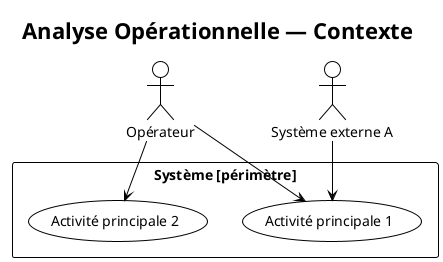
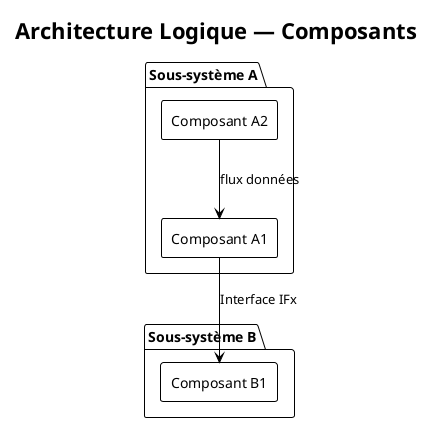

# CLAUDE.md — Architecture Document (ARCADIA MBSE)

## Contexte

Ce dossier contient un document d'architecture système produit selon la méthode **ARCADIA** (Architecture Analysis and Design Integrated Approach), une approche MBSE (Model-Based Systems Engineering).

Le document est rédigé en **AsciiDoc** et les diagrammes sont générés avec **PlantUML**.

---

## Méthode ARCADIA — Rappel des niveaux

L'architecture suit les quatre niveaux d'analyse d'ARCADIA, dans cet ordre :

1. **OA — Operational Analysis** : besoins et activités des parties prenantes, contexte opérationnel
2. **SA — System Analysis** : fonctions attendues du système, interfaces avec les acteurs
3. **LA — Logical Architecture** : décomposition fonctionnelle logique, composants logiques et échanges
4. **PA — Physical Architecture** : décomposition physique, composants matériels/logiciels, déploiement

Chaque niveau doit être traité dans son propre fichier AsciiDoc et son propre répertoire de diagrammes.

---

## Structure des fichiers

```
.
├── CLAUDE.md
├── main.adoc                  ← point d'entrée principal (includes tous les chapitres)
├── 00-introduction/
│   └── introduction.adoc
├── 01-operational-analysis/
│   ├── oa.adoc
│   └── diagrams/
│       ├── oa-context.puml
│       ├── oa-activity.puml
│       └── oa-capability.puml
├── 02-system-analysis/
│   ├── sa.adoc
│   └── diagrams/
│       ├── sa-functional-chain.puml
│       └── sa-dataflow.puml
├── 03-logical-architecture/
│   ├── la.adoc
│   └── diagrams/
│       ├── la-component.puml
│       └── la-sequence.puml
├── 04-physical-architecture/
│   ├── pa.adoc
│   └── diagrams/
│       ├── pa-deployment.puml
│       └── pa-component.puml
└── glossary.adoc
```

---

## Conventions AsciiDoc

### En-tête de chaque fichier `.adoc`

```asciidoc
= Titre du chapitre
:doctype: book
:toc:
:toclevels: 3
:sectnums:
:imagesdir: diagrams
:plantuml-format: svg
```

### Inclusion d'un diagramme PlantUML

```asciidoc
.Titre du diagramme
[plantuml, nom-du-fichier, svg]
----
include::diagrams/nom-du-fichier.puml[]
----
```

### Structure type d'un chapitre ARCADIA

La structure est identique pour les quatre niveaux ; seuls le vocabulaire et les diagrammes varient.

```asciidoc
== Niveau XX — Nom du niveau

=== Objectif

Courte description de ce que ce niveau modélise et de son périmètre dans la démarche ARCADIA.

=== Éléments identifiés

Tableau des éléments propres à ce niveau (adapter l'intitulé de la colonne « Type » selon le niveau) :

[cols="1,2,3", options="header"]
|===
| Identifiant | Nom | Description

| XX-YYY-001  | Nom de l'élément | Description courte
|===

// OA  → Activités opérationnelles, acteurs opérationnels, capabilities
// SA  → Fonctions système, acteurs externes, chaînes fonctionnelles
// LA  → Composants logiques, fonctions allouées, interfaces logiques
// PA  → Composants physiques/logiciels, nœuds de déploiement, interfaces physiques

=== Diagrammes

// Inclure les diagrammes pertinents pour ce niveau.
// Voir le tableau « Types de diagrammes par niveau » dans les conventions PlantUML.

==== [Titre du premier diagramme]

.[Légende du diagramme]
[plantuml, xx-nom-du-diagramme, svg]
----
include::diagrams/xx-nom-du-diagramme.puml[]
----

==== [Titre du second diagramme]

.[Légende du diagramme]
[plantuml, xx-nom-du-second-diagramme, svg]
----
include::diagrams/xx-nom-du-second-diagramme.puml[]
----

=== Traçabilité

Tableau de traçabilité vers le niveau précédent (sauf pour OA) :

[cols="1,2,1,2", options="header"]
|===
| Identifiant (ce niveau) | Nom | Issu de (niveau N-1) | Justification

| XX-YYY-001 | Nom | XX-ZZZ-00x | Raffinement / allocation de ...
|===
```

---

## Conventions PlantUML

### Style global à inclure dans chaque `.puml`

```plantuml
!theme plain
skinparam defaultFontName "DejaVu Sans"
skinparam shadowing false
skinparam componentStyle rectangle
skinparam ArrowColor #444444
skinparam BackgroundColor #FAFAFA
skinparam BorderColor #888888
```

### Types de diagrammes par niveau ARCADIA

| Niveau | Types de diagrammes recommandés          | Syntaxe PlantUML      |
|--------|------------------------------------------|-----------------------|
| OA     | Contexte opérationnel, activités, capabilities | `usecase`, `activity` |
| SA     | Chaînes fonctionnelles, flux de données  | `sequence`, `usecase` |
| LA     | Composants logiques, interactions        | `component`, `sequence` |
| PA     | Déploiement, composants physiques        | `deployment`, `component` |

### Exemple — Diagramme de contexte OA (usecase)



### Exemple — Diagramme de composants LA



---

## Règles de rédaction

- Rédiger en **français** sauf si le projet impose l'anglais.
- Chaque élément ARCADIA (activité, fonction, composant, interface) doit avoir un **identifiant unique** : `OA-ACT-001`, `SA-FNC-003`, `LA-CMP-002`, `PA-PHY-005`.
- Les interfaces entre composants doivent être nommées et décrites.
- Chaque diagramme doit avoir un titre et une légende (caption AsciiDoc).
- Ne pas dupliquer du contenu entre niveaux : référencer (`<<identifiant>>`) plutôt que répéter.
- Les acronymes doivent être définis dans `glossary.adoc` à leur première apparition.

---

## Ce que Claude doit faire dans ce dossier

- Générer ou compléter des sections AsciiDoc en respectant la structure et les conventions ci-dessus.
- Créer des diagrammes PlantUML cohérents avec le niveau ARCADIA concerné.
- Respecter la numérotation des identifiants existants (vérifier avant d'en créer de nouveaux).
- Proposer systématiquement les quatre niveaux si une nouvelle fonctionnalité système est décrite.
- Signaler toute incohérence entre niveaux (ex. : un composant LA sans correspondance en SA).
- Ne jamais mélanger des éléments de niveaux différents dans un même diagramme.
- Mettre à jour `main.adoc` si un nouveau fichier `.adoc` est créé.
