= Manuel Utilisateur — Boutique en ligne
:doctype: book
:toc: left
:toc-title: Sommaire
:toclevels: 2
:icons: font
:lang: fr
:encoding: UTF-8
:pdf-page-size: A4
:pdf-page-layout: portrait
:pdf-page-margin: [2cm, 1.8cm, 2cm, 1.8cm]
:chapter-signifier: Partie
:part-signifier: Partie
:figure-caption: Écran
:table-caption: Tableau
:appendix-caption: Annexe
:note-caption: 💡 Note
:warning-caption: ⚠️ Attention
:tip-caption: 💡 Conseil

[colophon]
== À propos de ce manuel

Ce document décrit l'utilisation de la boutique en ligne à travers ses trois espaces :

* *Portail Acheteur* — navigation, panier, commande, suivi, compte
* *Back-office Vendeur* — catalogue, commandes, expéditions, personnalisation
* *Console Administrateur* — comptes utilisateurs, transporteurs, maintenance

Les captures d'écran reproduisent fidèlement les interfaces de chaque portail.
Les exemples de données (noms, montants, références) sont fictifs.

'''

= Expiration de session

Ce comportement est identique sur les trois espaces (Portail Acheteur, Back-office Vendeur, Console Administrateur).

Pour votre sécurité, une session est automatiquement clôturée après 30 minutes d'inactivité. Tant que vous naviguez activement, la session se prolonge d'elle-même en arrière-plan — vous n'avez rien à faire.

== Avertissement avant expiration

Deux minutes avant l'expiration, une fenêtre s'affiche par-dessus l'écran en cours, avec un compte à rebours :

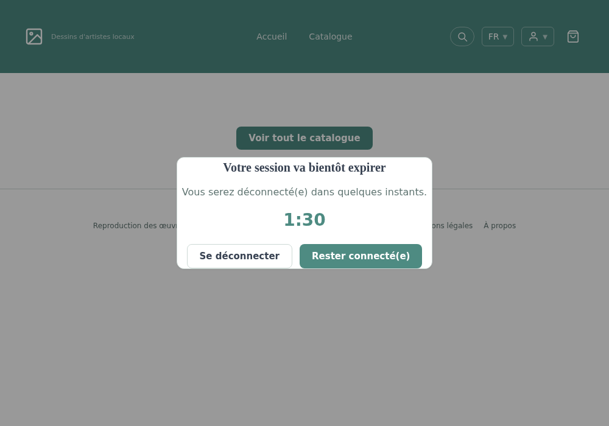

* *Rester connecté(e)* — prolonge immédiatement la session ; la fenêtre se referme et vous continuez votre activité sans interruption.
* *Se déconnecter* — ferme la session tout de suite et vous ramène à l'écran de connexion.

WARNING: Si aucune des deux options n'est choisie avant la fin du compte à rebours, la session expire réellement et la fenêtre bascule automatiquement vers l'état ci-dessous.

== Session expirée

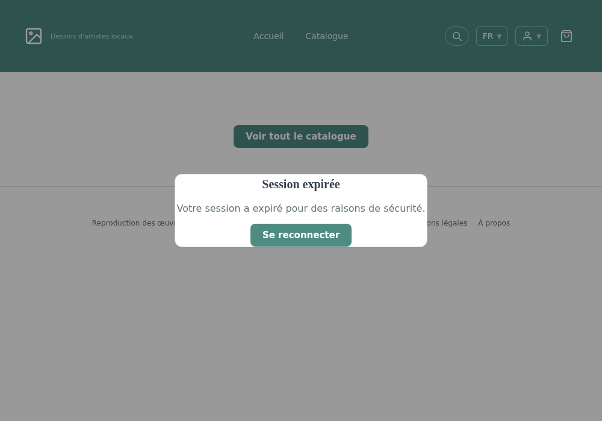

Cliquez sur *Se reconnecter* pour revenir à l'écran de connexion. Sur le Portail Acheteur, la fenêtre de connexion se rouvre directement par-dessus la page consultée, sans la quitter.

'''

= Portail Acheteur

== Créer un compte et se connecter

=== Inscription

Pour accéder à la boutique en tant qu'acheteur, commencez par créer votre compte.

.Procédure
. Depuis la page d'accueil, cliquez sur *S'inscrire*.
. Renseignez votre prénom, nom, adresse email et un mot de passe.
+
NOTE: Le mot de passe doit contenir au minimum 12 caractères, dont une majuscule, un chiffre et un caractère spécial.
. Cliquez sur *Créer mon compte*.
. Consultez votre messagerie : un email d'activation vous est envoyé dans les minutes suivantes.

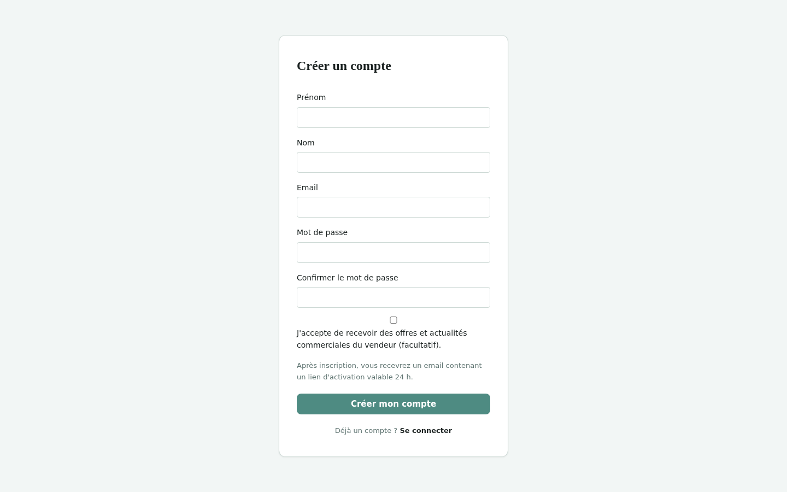

=== Activation du compte

Une fois l'email reçu, vous devez définir votre mot de passe pour activer le compte.

.Procédure
. Cliquez sur le lien d'activation dans l'email (valable 24 h).
. Définissez votre mot de passe sur la page qui s'ouvre.
. Cliquez sur *Activer mon compte*.

WARNING: Si le lien est expiré, retournez sur la page de connexion et cliquez sur *Renvoyer l'email d'activation*.

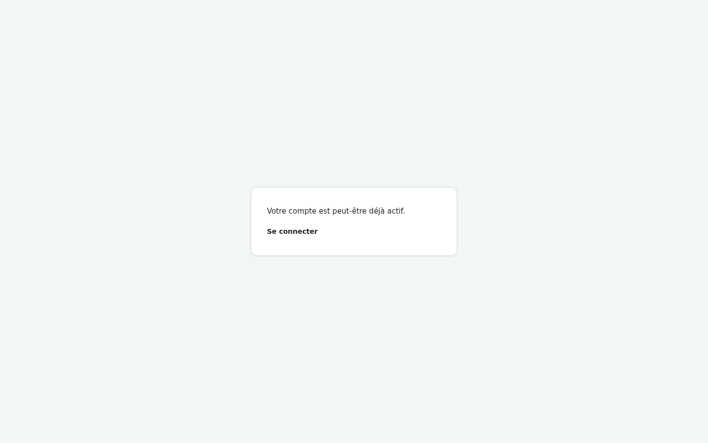

=== Connexion

.Procédure
. Rendez-vous sur la page d'accueil et cliquez sur *Se connecter*.
. Saisissez votre adresse email et votre mot de passe.
. Cochez *Se souvenir de moi* pour rester connecté sur cet appareil.
. Cliquez sur *Se connecter*.

TIP: Si vous avez oublié votre mot de passe, cliquez sur *Mot de passe oublié ?* pour recevoir un email de réinitialisation.

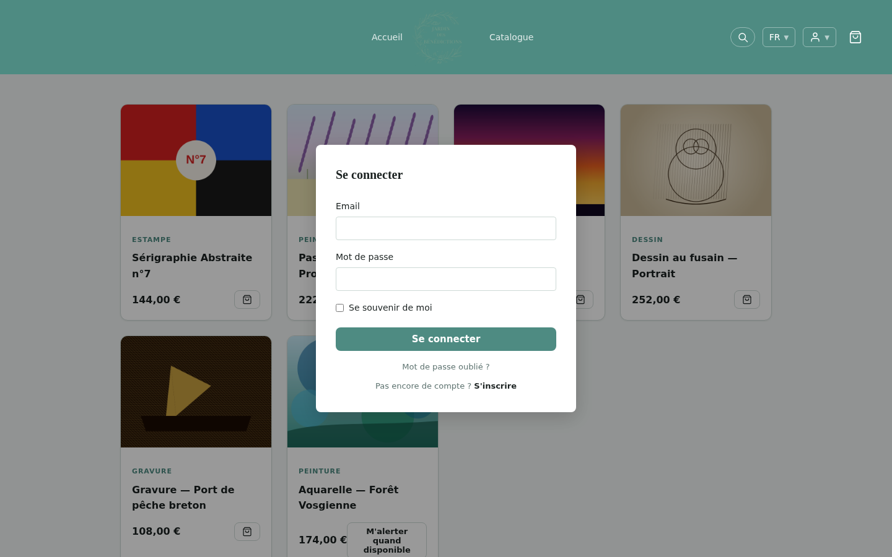

== Naviguer dans le catalogue

=== Page d'accueil

La page d'accueil présente la bannière de la boutique, le carrousel d'annonces promotionnelles et une sélection de produits mis en avant.

.Procédure
. Cliquez sur le logo ou sur *Accueil* dans la barre de navigation pour revenir à la page d'accueil.
. Le carrousel défile automatiquement — les flèches `<` et `>` permettent de naviguer manuellement.
. Cliquez sur *Voir tout le catalogue* pour accéder à l'ensemble des produits.

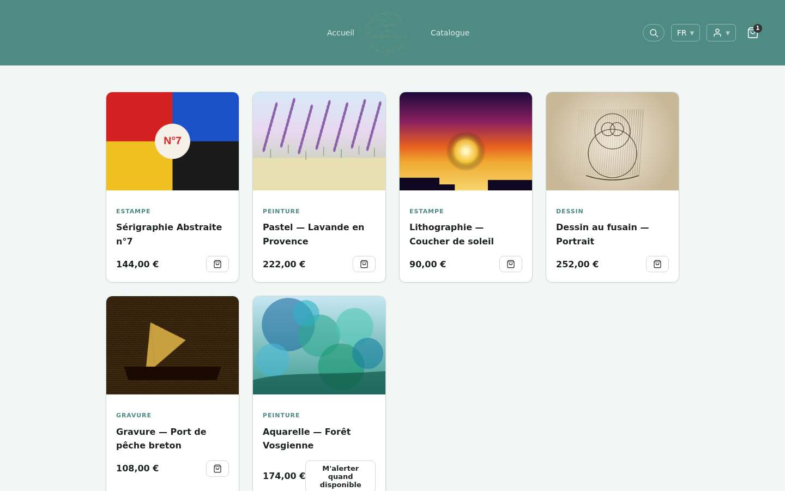

=== Catalogue produits

Le catalogue permet de filtrer et de parcourir tous les produits disponibles.

.Procédure
. Cliquez sur *Catalogue* dans la barre de navigation.
. Utilisez les champs *Catégorie* et *Thème / occasion* pour affiner l'affichage.
. Utilisez la barre de recherche pour trouver un produit par mot-clé.
. Ajustez la quantité avec les boutons `[−]` et `[+]`, puis cliquez sur *Ajouter au panier*.
. Les produits en rupture de stock affichent le bouton *Indisponible* — ils ne sont pas commandables.
. Pour un produit en rupture, cliquez sur *M'alerter* pour recevoir un email dès sa remise en stock.

NOTE: L'alerte de remise en stock nécessite d'être connecté. Si vous n'avez pas de compte, vous serez invité à vous inscrire ou à vous connecter avant de valider l'abonnement.

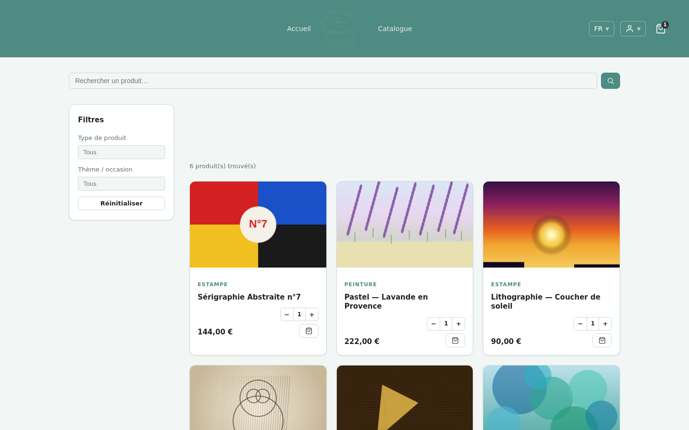

=== Fiche produit

La fiche produit affiche les photos, la description complète, le prix et la disponibilité.

.Procédure
. Cliquez sur le nom ou l'image d'un produit dans le catalogue.
. Consultez les photos (plusieurs angles disponibles).
. Sélectionnez la quantité souhaitée.
. Cliquez sur *Ajouter au panier*.

.Produit en rupture de stock
Si le produit est indisponible, le bouton *Ajouter au panier* est remplacé par *Indisponible*.
Cliquez sur *M'alerter* pour vous abonner à une notification par email dès la remise en stock.
L'abonnement est accessible aux visiteurs non connectés, qui seront invités à se connecter ou à s'inscrire pour confirmer.

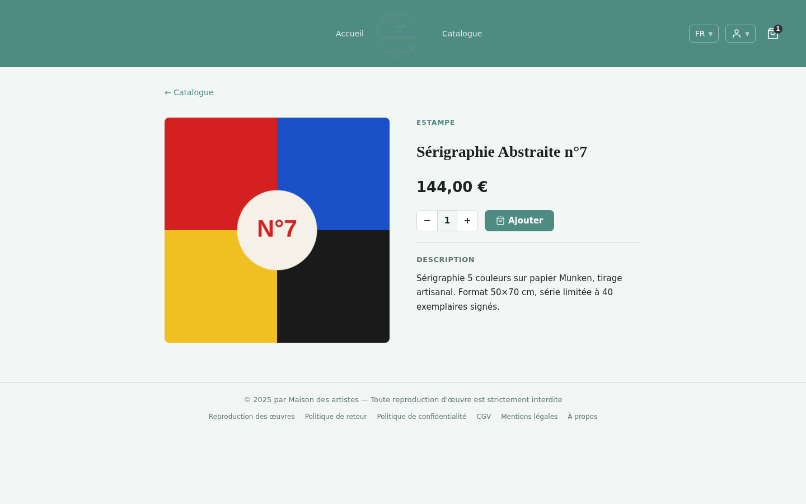

.Avis clients
La note moyenne et le nombre d'avis reçus par le produit s'affichent en bas de la fiche produit, suivis de la liste des avis (note et commentaire de chaque acheteur).
S'il n'y a pas encore d'avis, un message l'indique à la place de la liste.

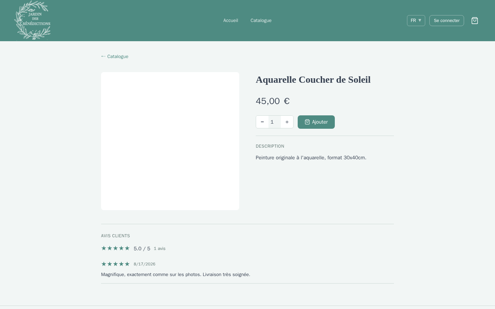

== Gérer son panier

Le panier conserve vos articles entre les sessions.
Vous pouvez modifier les quantités ou retirer des articles avant de valider votre commande.

.Procédure
. Cliquez sur l'icône *Panier* en haut à droite pour accéder à votre panier.
. Modifiez les quantités en saisissant directement la valeur dans le champ de chaque ligne.
. Cliquez sur *[Retirer]* pour supprimer un article.
. Cliquez sur *Continuer mes achats* pour revenir au catalogue sans perdre le panier.
. Cliquez sur *Valider le panier* pour démarrer le tunnel d'achat.

NOTE: Le contenu du panier est automatiquement sauvegardé — vous le retrouvez intact à la prochaine connexion.

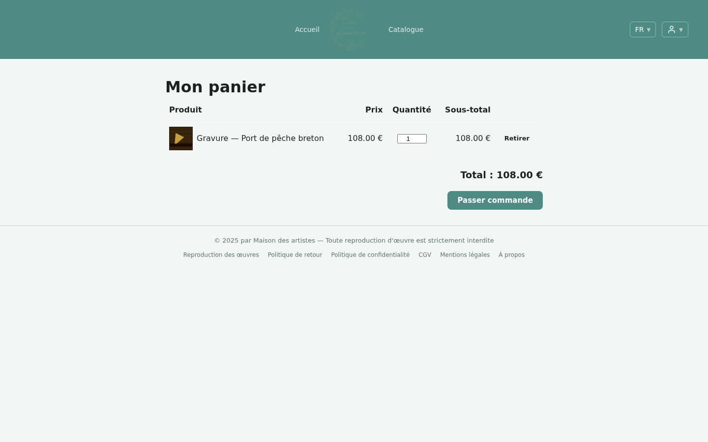

== Passer une commande

=== Étape 1 — Adresse et mode de livraison

.Procédure
. Depuis votre panier, cliquez sur *Valider le panier*.
. Sélectionnez une adresse de livraison parmi celles enregistrées dans votre carnet, ou cliquez sur *Utiliser une nouvelle adresse*.
. Choisissez un mode de livraison parmi les transporteurs disponibles.
. Cliquez sur *Continuer vers le paiement*.

NOTE: Seules les adresses situées en zone euro sont acceptées.

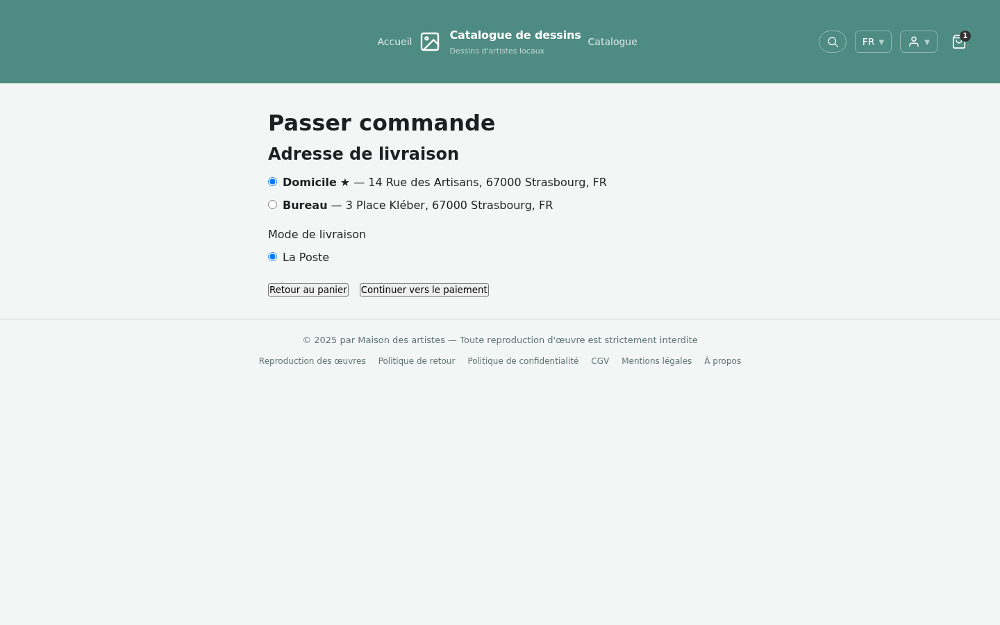

=== Étape 2 — Paiement

Deux modes de paiement sont disponibles : carte bancaire et virement bancaire.

.Procédure — Carte bancaire
. Sélectionnez *Carte bancaire*.
. Saisissez le numéro de carte, la date d'expiration et le CVV.
. Cliquez sur *Confirmer et payer*. Le débit est immédiat.

.Procédure — Virement bancaire
. Sélectionnez *Virement bancaire*.
. Cliquez sur *Confirmer et payer*.
. Les coordonnées IBAN vous sont communiquées sur la page de confirmation.
. Effectuez le virement depuis votre banque. La commande est traitée après réception des fonds.

WARNING: Les données de carte bancaire sont transmises directement à Stripe et ne transitent jamais en clair sur nos serveurs.

NOTE: Si la banque refuse la transaction, un message précise la raison lorsqu'elle est connue (fonds insuffisants, carte expirée, code de sécurité incorrect…) plutôt qu'un message générique — vous pouvez alors réessayer avec une autre carte.

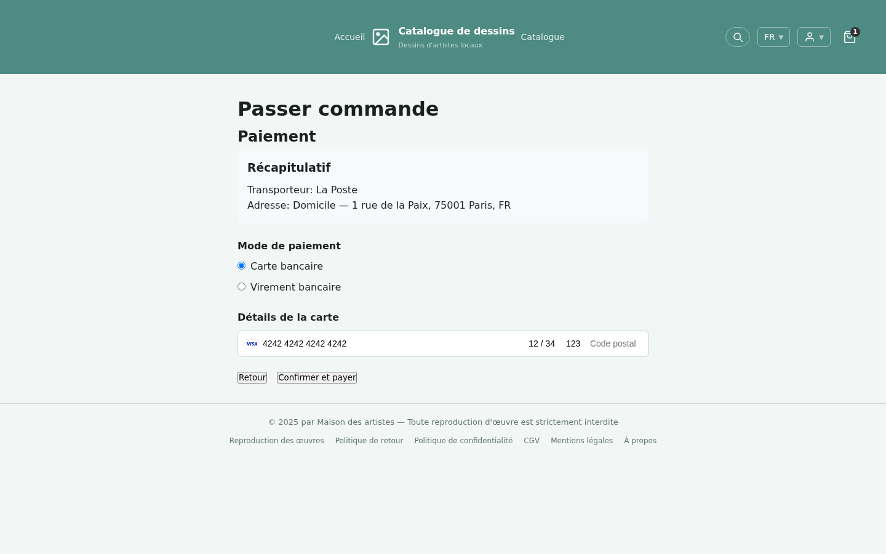

=== Confirmation de commande

Après validation, un email de confirmation est envoyé à votre adresse. La page de confirmation affiche le récapitulatif et la date de livraison estimée.

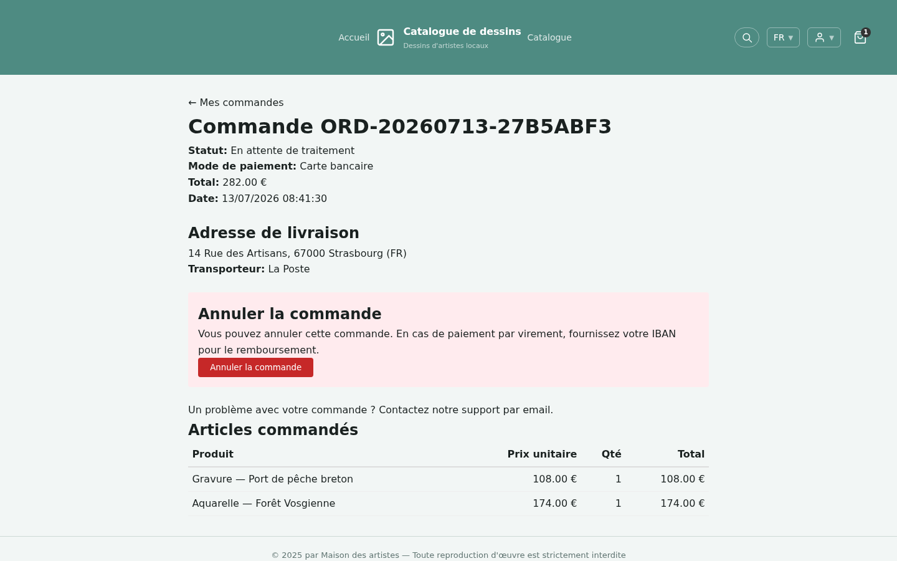

== Suivre et annuler une commande

=== Suivi de commande

.Procédure
. Connectez-vous, puis cliquez sur *Mon compte* → onglet *Mes commandes*.
. Cliquez sur une référence de commande pour en voir le détail.
. Une fois la commande expédiée, le numéro de suivi et un lien vers le site du transporteur apparaissent.

Pour un paiement par carte, la marque de la carte et ses 4 derniers chiffres (ex. « Visa se terminant par 4242 ») s'affichent à côté du mode de paiement, une fois le paiement confirmé.

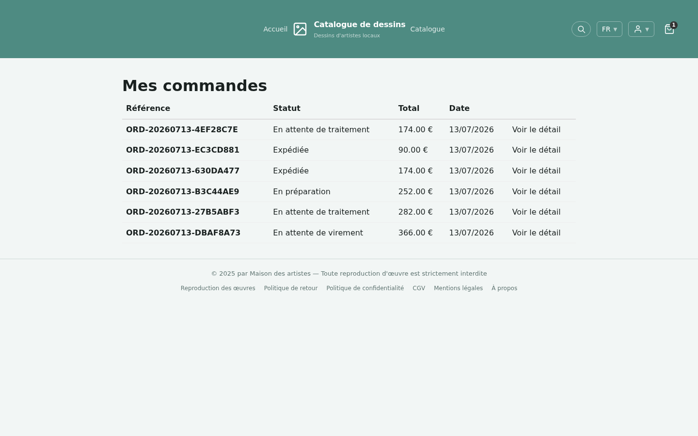

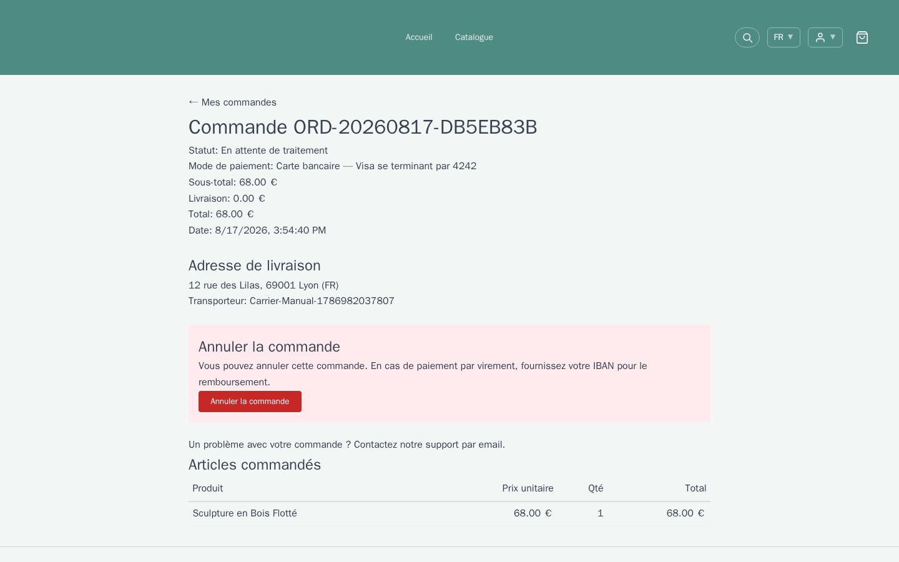

=== Laisser un avis sur un produit reçu

Une fois une commande livrée, vous pouvez déposer un avis (note de 1 à 5 étoiles, commentaire facultatif) sur chaque produit reçu.
Vous recevez également un email vous invitant à donner votre avis quelques jours après la livraison.

.Procédure
. Depuis le détail d'une commande livrée, cliquez sur *Laisser un avis* sous le produit concerné.
. Sélectionnez une note en cliquant sur le nombre d'étoiles souhaité.
. Rédigez un commentaire (facultatif).
. Cliquez sur *Envoyer*.

NOTE: Vous ne pouvez déposer qu'un seul avis par produit acheté. Une seule modification de la note et/ou du commentaire est possible après le dépôt initial ; passé cette modification, l'avis est définitif.

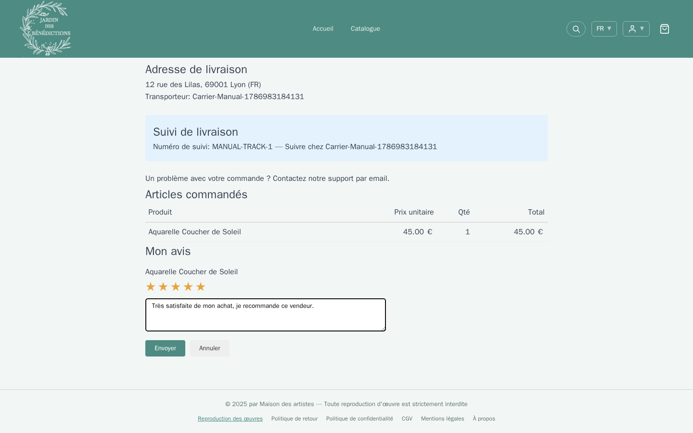

=== Annulation avant expédition

Vous pouvez annuler une commande tant qu'elle n'a pas encore été expédiée.

.Procédure
. Depuis le détail de commande, cliquez sur *Annuler la commande*.
. Sélectionnez un motif (facultatif).
. Cliquez sur *Confirmer l'annulation*.
. Le remboursement est déclenché automatiquement (3 à 5 jours ouvrés sur votre carte bancaire).

.Procédure — Remboursement par virement (paiement initial en virement)
. Suivez les étapes ci-dessus.
. Renseignez votre IBAN dans le champ prévu pour recevoir le remboursement.

image::screenshots/pa-annulation.png[pa-annulation, 1200]

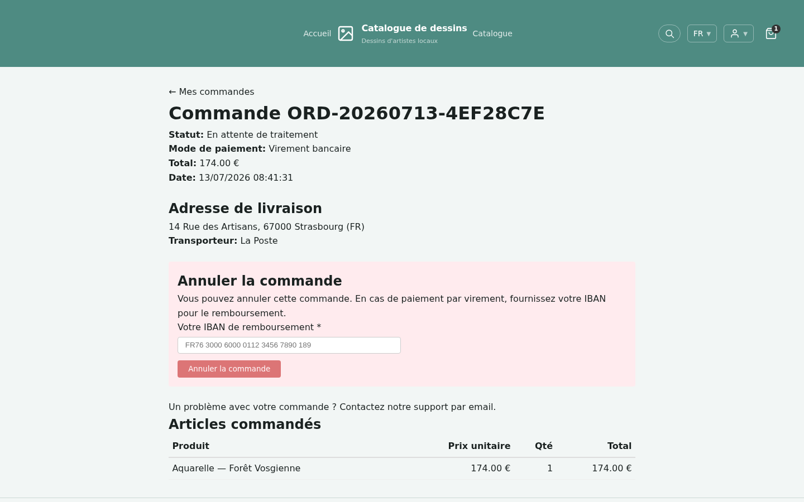

=== Annulation après expédition

Si votre commande a déjà été expédiée, vous pouvez soumettre une demande d'annulation au vendeur.

.Procédure
. Depuis le détail de commande, cliquez sur *Annuler la commande*.
. Rédigez un message expliquant votre demande.
. Cliquez sur *Envoyer la demande*.
. Le vendeur accepte ou refuse sous 48 h. Vous serez notifié par email.

NOTE: En cas d'acceptation avec condition de renvoi, vous devez retourner le colis avant d'être remboursé.

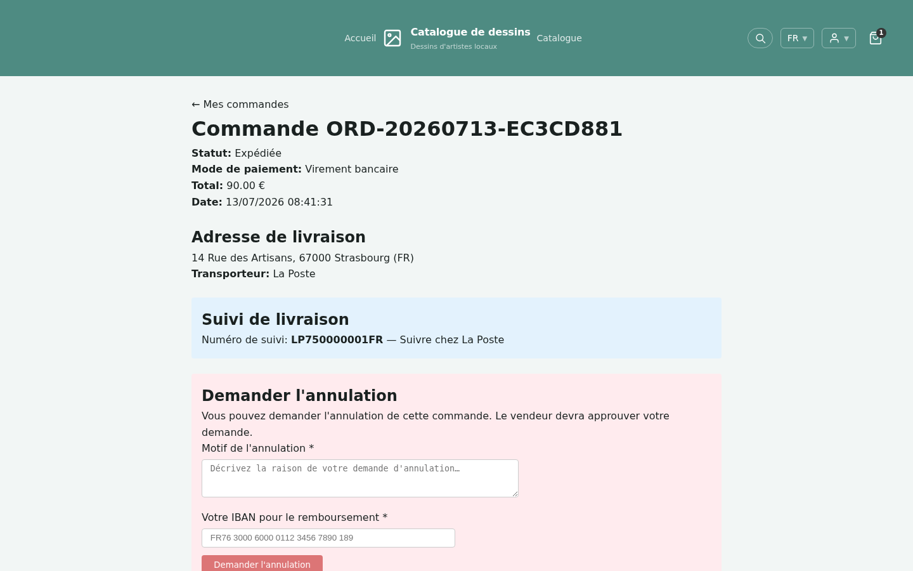

== Mon compte

=== Informations personnelles

.Procédure
. Cliquez sur votre prénom dans la barre de navigation, puis sur *Mon compte*.
. L'onglet *Mon profil* affiche vos informations personnelles modifiables.
. Modifiez les champs souhaités et cliquez sur *Enregistrer les modifications*.

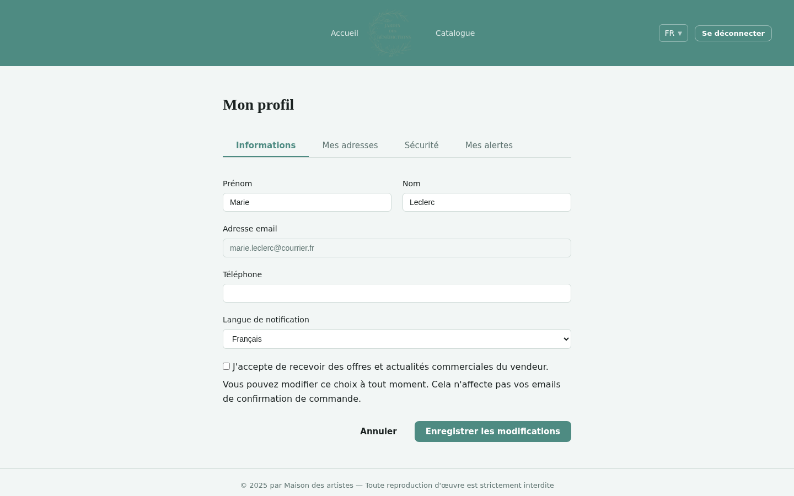

=== Carnet d'adresses

.Procédure — Ajouter une adresse
. Cliquez sur l'onglet *Mes adresses*.
. Cliquez sur *+ Ajouter une adresse*.
. Remplissez le formulaire (libellé, destinataire, adresse, ville, code postal, pays en zone euro).
. Cochez *Définir comme adresse par défaut* si nécessaire.
. Cliquez sur *Enregistrer*.

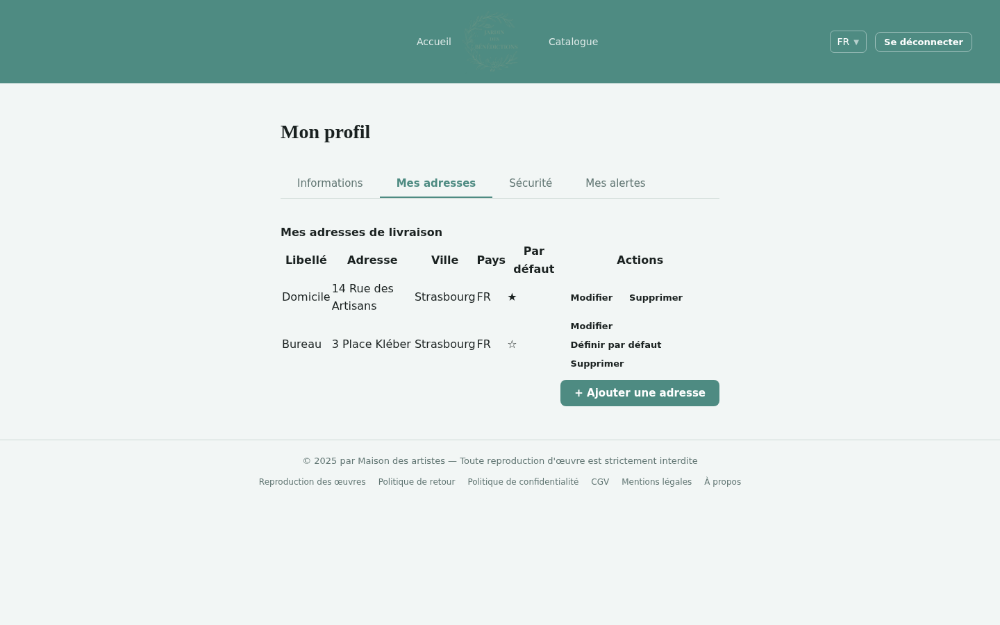

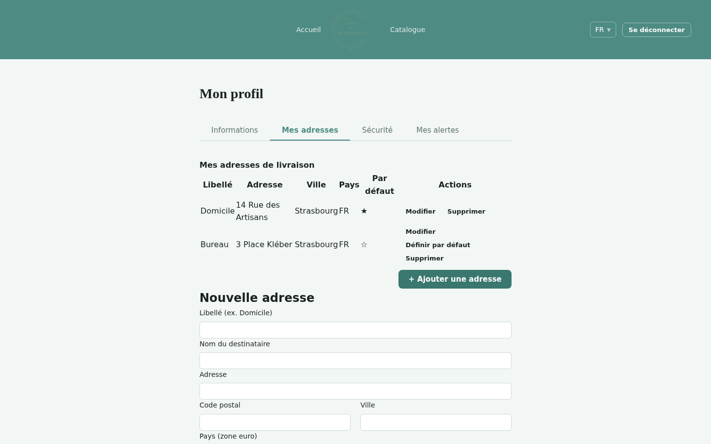

'''

= Back-office Vendeur

== Tableau de bord

Le tableau de bord est la première page affichée à la connexion.
Il présente les indicateurs clés de l'activité et les dernières commandes à traiter.

.Procédure
. Connectez-vous au back-office vendeur.
. Les compteurs en haut de page indiquent le nombre de commandes par statut.
. La liste *Dernières commandes* affiche les commandes récentes avec un accès rapide aux actions disponibles.

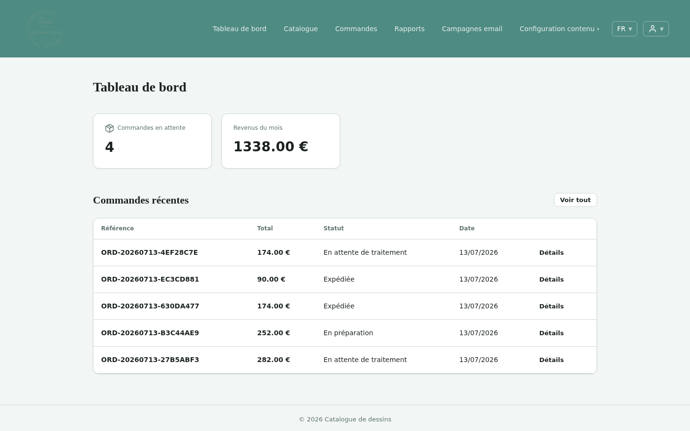

== Gérer le catalogue

=== Liste des produits

.Procédure
. Cliquez sur *Catalogue* dans la barre de navigation.
. La liste affiche tous vos produits avec leur stock actuel, le seuil d'alerte et leur statut.
. Les produits en *Alerte !* ou *Rupture !* sont signalés pour action immédiate.

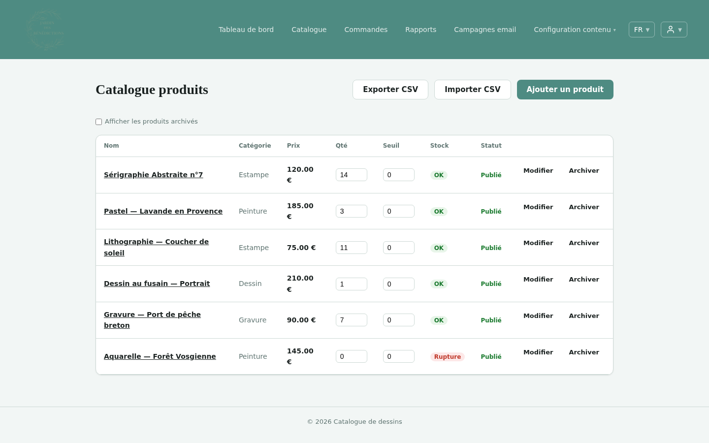

=== Créer ou modifier un produit

.Procédure
. Cliquez sur *+ Nouveau produit* (création) ou *[Modifier]* sur la ligne d'un produit existant.
. Renseignez le nom, le type, le thème, la description et le prix.
. Ajoutez des photos avec le bouton *[Ajouter une photo]*.
. Définissez la quantité disponible et le seuil d'alerte de stock.
. Choisissez le statut : *Publié* (visible sur le portail acheteur) ou *Archivé*.
. Cliquez sur *Enregistrer les modifications*.

NOTE: L'archivage d'un produit est bloqué s'il est référencé dans une commande active.

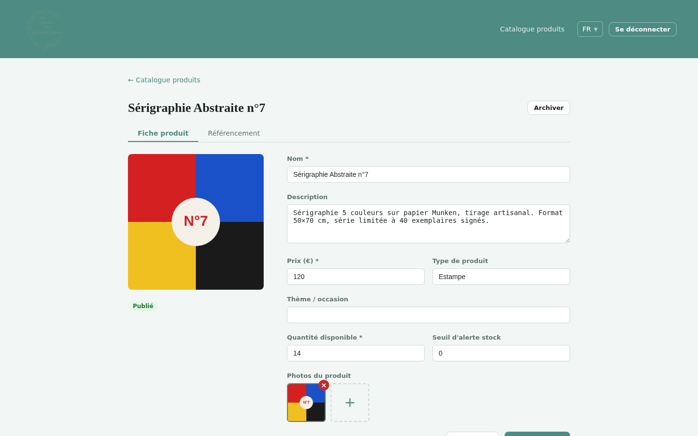

=== Export CSV

L'export CSV permet de télécharger l'ensemble du catalogue (produits publiés et archivés) dans un fichier réutilisable, par exemple pour le réimporter après modification.

.Procédure
. Depuis la page *Catalogue*, cliquez sur *Exporter CSV*.
. Une fenêtre s'ouvre pour choisir les colonnes optionnelles à inclure. Les colonnes `id`, `nom` et `prix` sont toujours présentes.
+
NOTE: Toutes les colonnes optionnelles sont cochées par défaut. Utilisez *Tout désélectionner* pour repartir de zéro, ou décochez individuellement celles dont vous n'avez pas besoin.
. Cliquez sur *Exporter* pour télécharger le fichier.

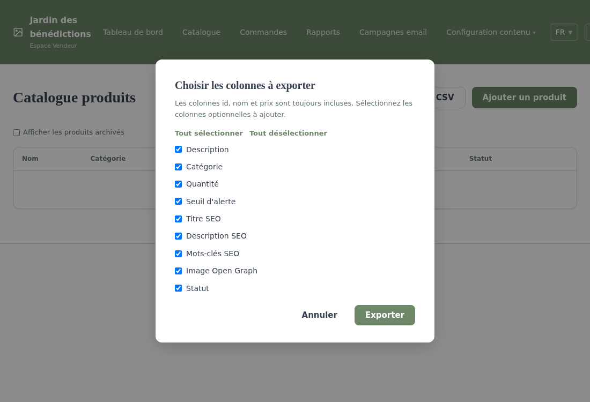

TIP: Un export ne contenant que les colonnes `id`, `nom`, `prix` et `categorie` est utile pour une mise à jour rapide des catégories sans risquer d'écraser d'autres champs à la réimportation.

=== Import CSV

L'import CSV permet d'ajouter ou de mettre à jour plusieurs produits en une seule opération.

.Procédure
. Depuis la page *Catalogue*, cliquez sur *Importer un CSV*.
. Préparez votre fichier CSV avec les colonnes : `nom`, `description`, `prix`, `categorie`, `quantite`, `seuil_alerte`.
+
NOTE: Les colonnes `nom` et `prix` sont obligatoires.
. Sélectionnez le fichier et cliquez sur *Importer*.
. Le résultat indique le nombre de produits créés et les éventuelles erreurs avec leur ligne correspondante.

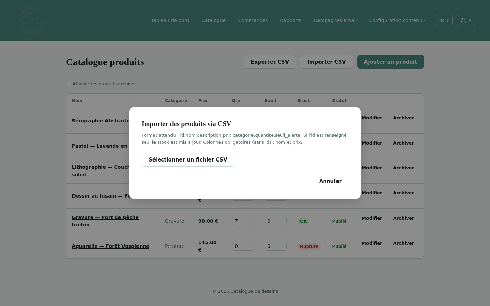

=== Annonces défilantes

Les annonces défilantes apparaissent sur la page d'accueil du portail acheteur.

.Procédure
. Dans le menu *Paramètres*, accédez à *Annonces*.
. Cliquez sur *+ Ajouter une annonce* pour en créer une nouvelle.
. Pour chaque annonce, définissez le type (texte, image ou texte + image), le contenu et l'ordre d'affichage.
. Utilisez les boutons `[↑]` et `[↓]` pour réordonner les annonces.
. Cliquez sur *Enregistrer* sur chaque annonce modifiée.

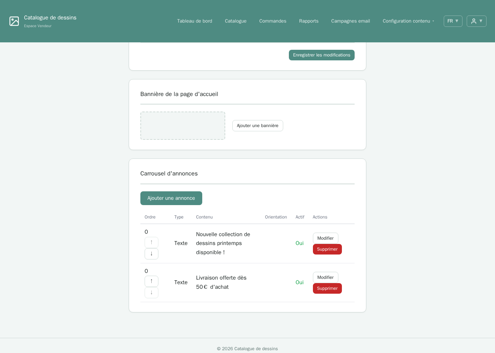

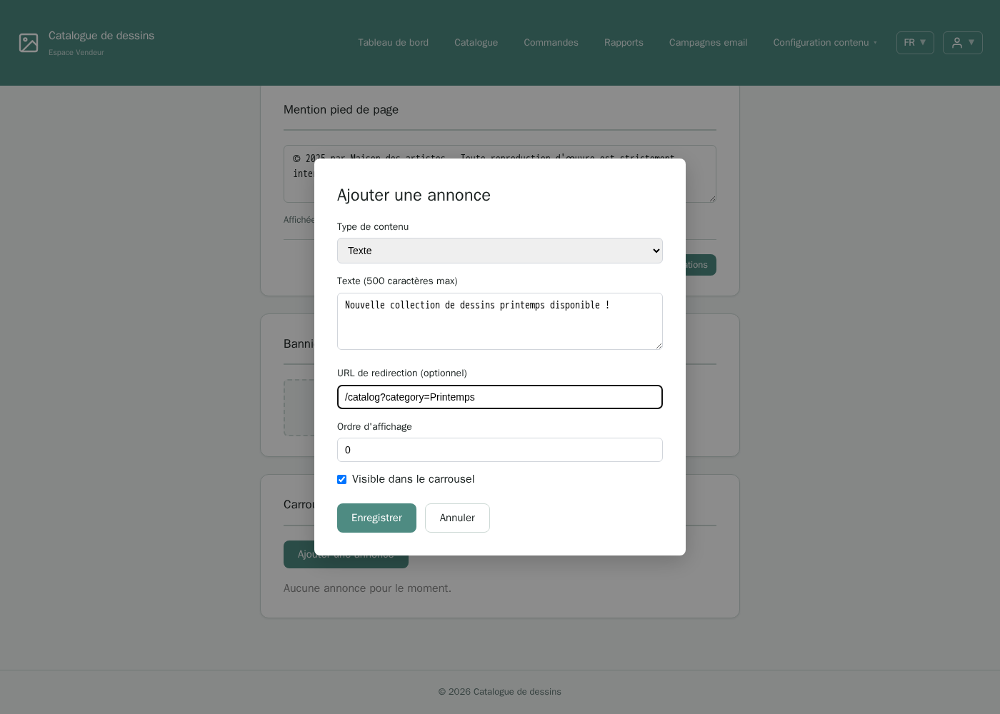

== Traiter les commandes

=== Détail d'une commande

.Procédure
. Depuis le tableau de bord ou la liste des commandes, cliquez sur *[Traiter]* ou *[Voir]*.
. Vérifiez les informations : articles commandés, adresse de livraison, mode de paiement.
. Cliquez sur *Marquer en préparation* pour indiquer que la commande est en cours de préparation.
. Une fois le colis prêt, cliquez sur *Déclarer l'expédition*.

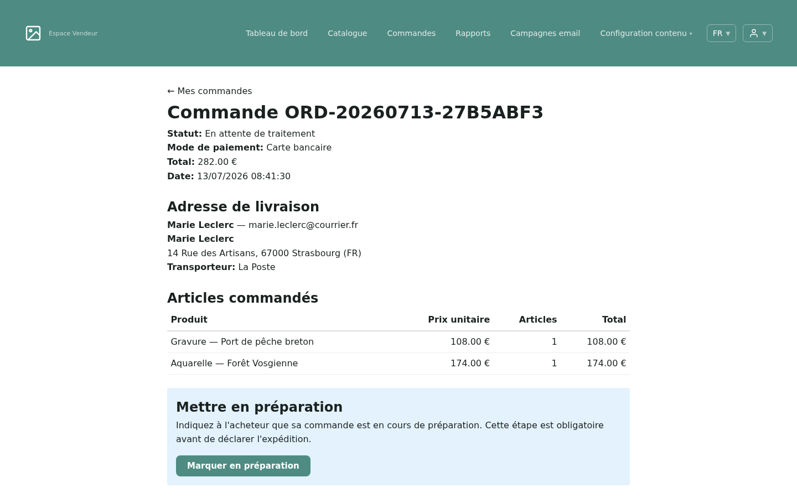

=== Confirmer un virement bancaire

Lorsqu'un acheteur a choisi le paiement par virement, vous devez confirmer la réception des fonds avant de traiter la commande.

.Procédure
. Depuis le tableau de bord, cliquez sur *[Confirmer]* dans la colonne *Virement en attente*.
. Vérifiez votre relevé bancaire que le montant et la référence correspondent.
. Cliquez sur *Confirmer la réception* pour démarrer la préparation.
. Cliquez sur *Rejeter le virement* si les fonds ne sont pas reçus — la commande est annulée automatiquement.

WARNING: Ne confirmez que si vous avez bien reçu le virement sur votre compte bancaire.

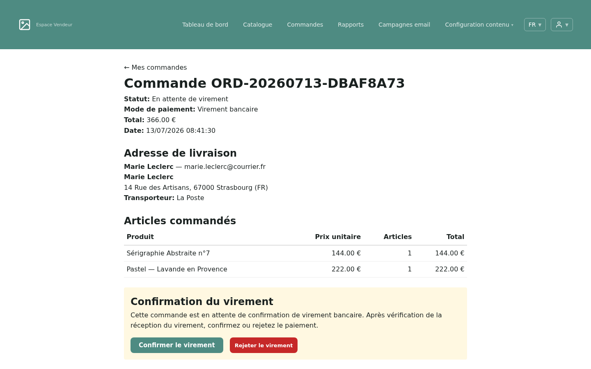

=== Traitement des annulations après expédition

Lorsqu'un acheteur soumet une demande d'annulation après expédition, vous recevez une notification et devez statuer.

.Procédure
. Accédez à la commande concernée — elle affiche le message de l'acheteur.
. Choisissez l'une des trois options :
+
--
* *Accepter avec condition de renvoi* — l'acheteur doit retourner le colis ; le remboursement est effectué à réception.
* *Accepter sans condition de renvoi* — remboursement immédiat sans retour.
* *Refuser la demande* — la commande reprend son état *Expédiée*.
--
. Cliquez sur *Valider la décision*.

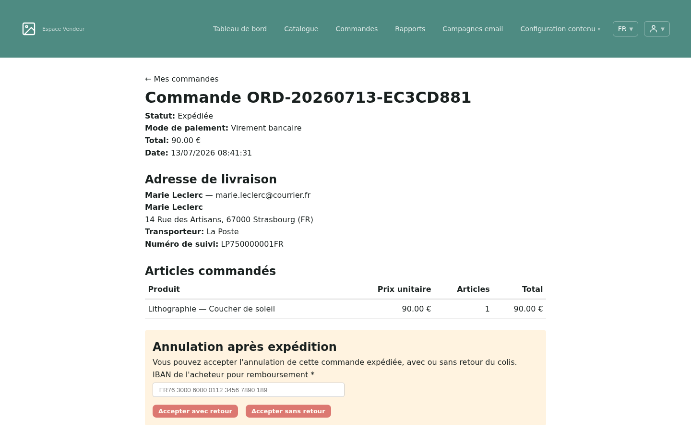

== Déclarer une expédition

Une fois le colis déposé chez le transporteur, déclarez l'expédition dans le back-office.

.Procédure
. Depuis le détail de commande, cliquez sur *Déclarer l'expédition*.
. Sélectionnez le transporteur utilisé.
. Saisissez le numéro de suivi figurant sur le reçu de dépôt.
. Cliquez sur *Enregistrer l'expédition*.
. La commande passe en statut *Expédiée* et l'acheteur reçoit un email avec le numéro de suivi.

NOTE: Le numéro de suivi est fourni par le transporteur sur le reçu de dépôt — il n'est jamais généré automatiquement par la plateforme.

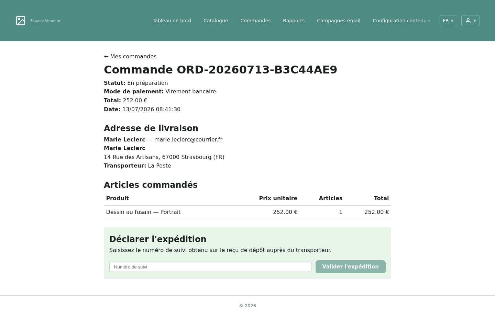

== Identité visuelle

Personnalisez l'apparence du portail acheteur avec votre logo, votre bannière hero et vos couleurs.

.Procédure
. Dans le menu principal, cliquez sur votre prénom, puis *Paramètres* → onglet *Identité visuelle*.
. Téléversez votre logo (JPEG, PNG ou WebP) — il s'affiche dans l'en-tête des deux portails.
. Téléversez une image de bannière hero pour la page d'accueil (format paysage recommandé, 1 200 × 400 px minimum).
. Définissez la couleur principale, la couleur de fond et la couleur du texte en saisissant les valeurs hexadécimales (un gris doux et lisible est utilisé par défaut si vous ne personnalisez pas la couleur du texte).
. Cliquez sur *Valider les couleurs*. Les modifications sont visibles immédiatement sur le portail acheteur.

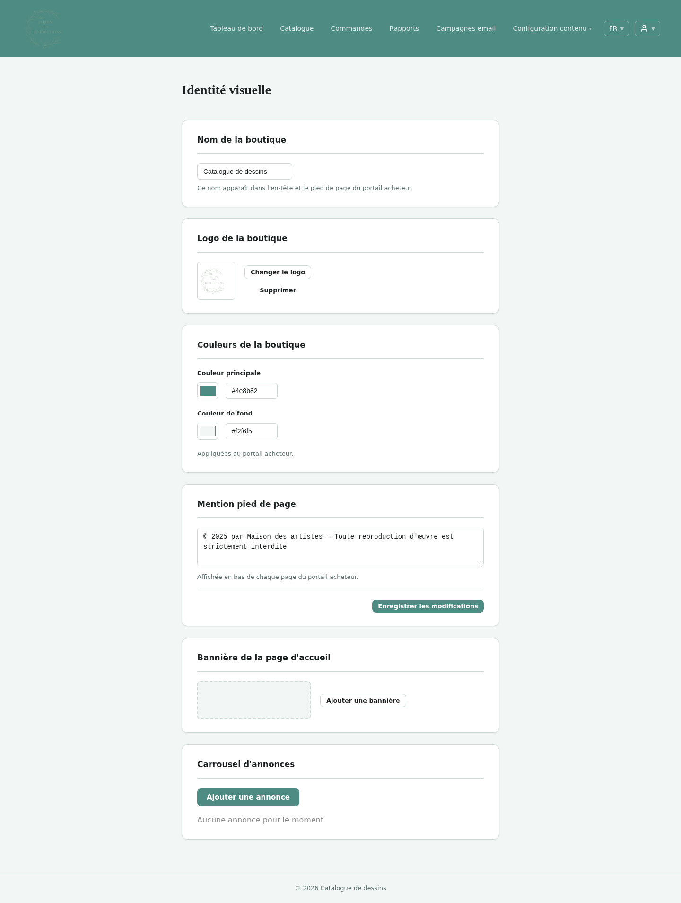

== Campagne email promotionnelle

Envoyez une campagne email aux acheteurs ayant consenti à recevoir vos communications marketing.
Le message doit être rédigé dans chacune des langues effectivement utilisées par au moins un destinataire consentant ; chaque destinataire reçoit la version correspondant à sa langue.

.Procédure
. Dans le menu, cliquez sur *Campagnes email*.
. Le nombre de destinataires consentants est affiché automatiquement en haut de page.
. Pour chaque onglet de langue (*Français*, *English*, *Español*), renseignez l'*Objet* et le *Message*. Une langue est obligatoire, uniquement si au moins un des utilisateurs actif a sélectionné cette langue pour les notifications. L'aperçu à droite affiche le rendu final de l'email (objet et corps), avec la mise en forme définie dans *Modèle d'email*, pour la langue actuellement sélectionnée.
. Cliquez sur *Envoyer la campagne*.

Après l'envoi, un message indique le résultat :

* *Envoyée* — tous les destinataires ont reçu l'email.
* *Envoi partiel* — certains envois ont échoué (fournisseur email temporairement indisponible, par exemple).
* *Échec total* — aucun envoi n'a abouti ; vérifiez la configuration email.
* *Fournisseur non configuré* — la campagne est enregistrée mais aucun email n'est réellement envoyé tant qu'aucun fournisseur (SendGrid ou Gmail SMTP) n'est configuré par l'administrateur (voir <<_configuration_email>>).

NOTE: Seuls les acheteurs ayant activé la case *J'accepte de recevoir vos offres* dans leur profil figurent dans la liste de destinataires. Cette liste est exportable au format CSV depuis la page *Rapports* (bouton *Exporter la liste mailing*).

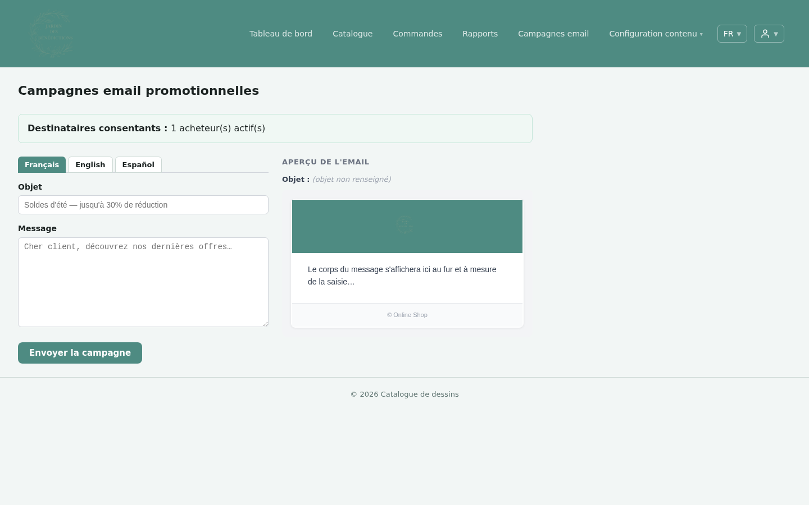

== Rapports de ventes

Consultez vos performances commerciales et exportez les données pour vos analyses.

.Procédure
. Cliquez sur *Rapports* dans la barre de navigation (ou depuis le tableau de bord).
. Sélectionnez la période via les champs *Du* et *Au*, puis cliquez sur *Appliquer*.
. Les indicateurs (chiffre d'affaires, nombre de commandes, panier moyen, taux d'annulation) se mettent à jour.
. La liste *Produits les plus vendus* classe vos articles par quantité vendue.
. Cliquez sur *Exporter en CSV* pour télécharger les données.

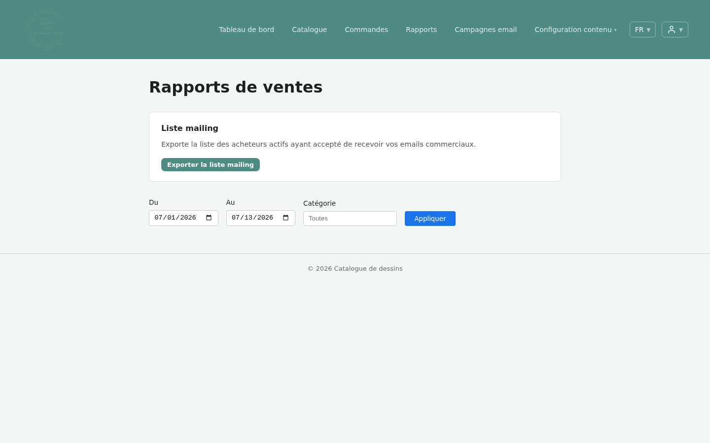

== Pages légales

Rédigez et publiez les documents légaux accessibles aux acheteurs depuis le portail (CGV, mentions légales, politique de confidentialité, politique de retour, à propos, droits de reproduction).

.Procédure
. Dans le menu principal, cliquez sur *Paramètres* → *Pages légales*.
. Sélectionnez le document à modifier dans la liste (ex. *CGV*).
. Rédigez ou modifiez le contenu dans l'éditeur de texte.
. Cliquez sur *Enregistrer* pour publier immédiatement la nouvelle version.

NOTE: Les pages légales sont visibles par tous les visiteurs du portail acheteur, sans authentification.

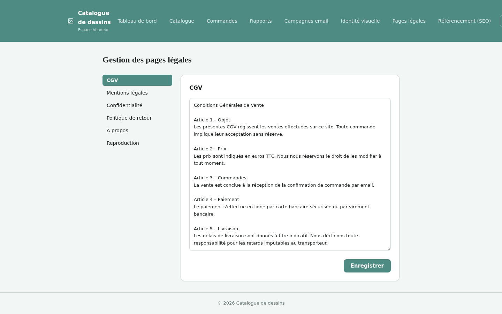

== Référencement (SEO)

Optimisez la visibilité de votre boutique dans les moteurs de recherche.

=== SEO global

.Procédure
. Dans le menu, cliquez sur *Paramètres* → *SEO*.
. L'onglet *Global* permet de définir le titre de la boutique, la méta-description, les mots-clés, l'image Open Graph et l'URL canonique.
. Cliquez sur *Enregistrer*.

=== SEO produits

. Cliquez sur l'onglet *Produits* pour surcharger les métadonnées de chaque fiche produit.
. Recherchez un produit, modifiez son titre et sa description SEO, puis cliquez sur *Enregistrer*.
. Cliquez sur *Réinitialiser* pour revenir aux valeurs générées automatiquement.

=== Indexation

. L'onglet *Indexation* contrôle les règles robots (autoriser/interdire l'indexation par page) et la fréquence du sitemap.
. Activez ou désactivez l'indexation par page avec les toggles, puis cliquez sur *Enregistrer*.

=== Outils

. L'onglet *Outils* permet de renseigner les codes de vérification Google Search Console et Bing Webmaster, ainsi que l'identifiant de suivi Google Analytics 4.
. Cliquez sur *Enregistrer* après chaque modification.

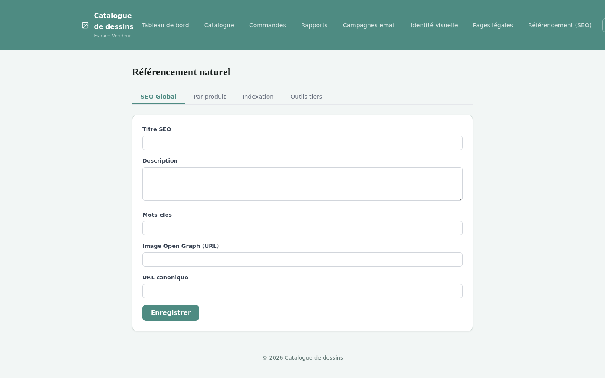

== Modèle d'email

Personnalisez l'apparence des emails transactionnels envoyés à vos acheteurs (confirmation de commande, expédition, annulation, etc.).
Toutes les modifications sont appliquées immédiatement aux prochains envois — les emails déjà expédiés ne sont pas rétroactivement modifiés.

.Procédure
. Dans la barre de navigation, cliquez sur *Modèle d'email*.
. Renseignez les champs selon vos besoins :
+
--
* *Nom de la boutique* — affiché en haut de chaque email si aucun logo n'est fourni (ex. « Galerie ArtLocal »).
* *Logo* — repris automatiquement de votre logo d'identité visuelle (lecture seule sur cette page). Pour le changer ou le retirer, rendez-vous sur *Identité visuelle* dans le menu. Sans logo, le nom de la boutique s'affiche à la place.
* *Couleur principale* — utilisée automatiquement depuis les paramètres d'identité visuelle de la boutique. Modifiez-la dans la section *Identité visuelle* du menu.
* *Texte du pied de page* — texte personnalisé affiché en bas de chaque email. Laissez vide pour afficher automatiquement « © Nom de la boutique ».
* *Image de remerciement* — image affichée en bas de l'email de confirmation de commande (JPEG, PNG ou WebP). Cliquez sur *Ajouter une image* (ou *Changer l'image* si une image est déjà définie) pour la téléverser ; cliquez sur *Supprimer* pour la retirer. Contrairement aux autres champs, l'ajout, le changement ou la suppression de cette image est appliqué immédiatement, sans passer par le bouton *Enregistrer*.
--
. L'aperçu à droite du formulaire se met à jour en temps réel à chaque modification.
. Cliquez sur *Enregistrer* pour appliquer les autres paramètres (nom de la boutique, texte du pied de page).

TIP: Le logo et la couleur principale des emails sont partagés avec le reste de la boutique — modifiez-les depuis *Identité visuelle* pour qu'ils se répercutent partout, y compris dans les emails.

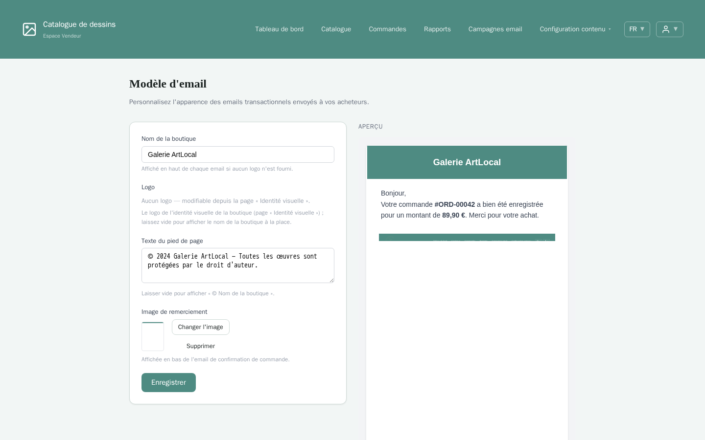

== Coordonnées bancaires

Renseignez les coordonnées du compte bancaire sur lequel vous recevez les virements de vos acheteurs.
Ces informations sont affichées sur la page de confirmation de commande et dans l'email envoyé à l'acheteur lorsqu'il choisit le paiement par virement.

.Procédure
. Dans la barre de navigation, cliquez sur *Coordonnées bancaires*.
. Renseignez votre *IBAN* — le numéro de compte sur lequel les virements sont reçus.
. Renseignez le *BIC / SWIFT* correspondant.
. Cliquez sur *Enregistrer*.

NOTE: L'IBAN et le BIC sont affichés tels quels à l'acheteur. Vérifiez leur exactitude avant d'enregistrer.

WARNING: Sans IBAN configuré, les acheteurs choisissant le virement ne pourront pas voir les coordonnées bancaires sur la page de confirmation.

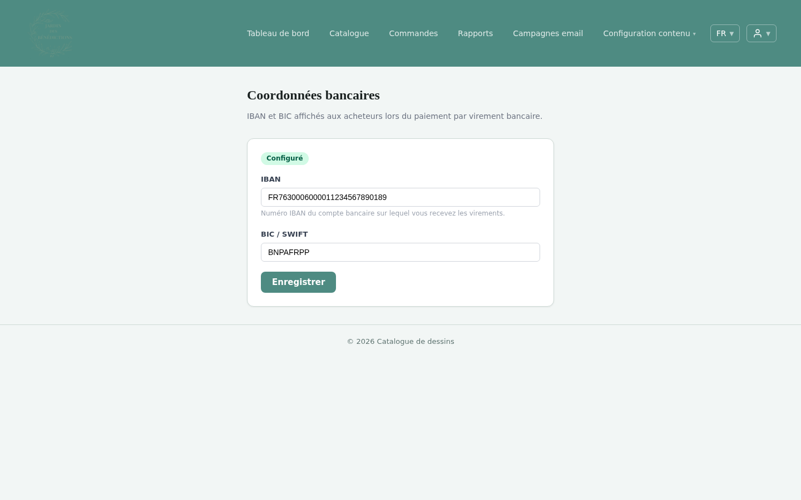

'''

= Console Administrateur

== Connexion

La console administrateur est accessible uniquement aux comptes de rôle *Administrateur*.

.Procédure
. Ouvrez l'URL de la console administrateur.
. Saisissez votre adresse email et mot de passe administrateur.
. Cliquez sur *Se connecter*.

WARNING: L'accès à la console est réservé aux administrateurs. Toute tentative de connexion avec un compte acheteur ou vendeur est rejetée.

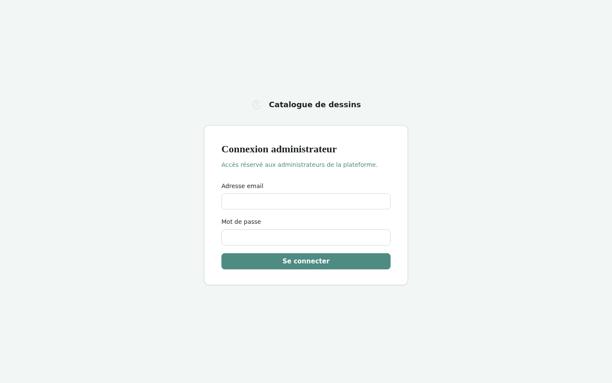

== Gestion des comptes

=== Liste des comptes

.Procédure
. Depuis la console, cliquez sur *Comptes*.
. Utilisez les filtres *Rôle* et *Statut* pour cibler un sous-ensemble d'utilisateurs.
. Cliquez sur *[Modifier]* pour modifier un compte, *[Suspendre]* pour le bloquer temporairement, ou *[Supprimer]* pour le supprimer définitivement.

WARNING: La suppression d'un compte est irréversible. Un avertissement est affiché avant confirmation.

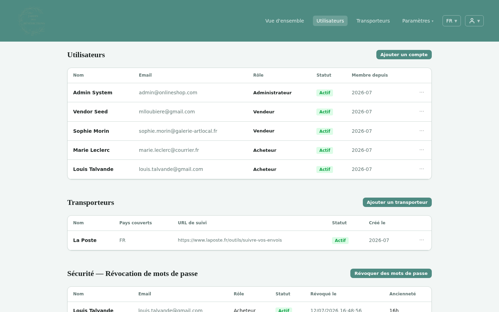

=== Créer un compte

Les comptes acheteur et vendeur sont créés par l'administrateur — il n'existe pas d'inscription publique pour les vendeurs.

.Procédure
. Cliquez sur *+ Créer un compte*.
. Renseignez le prénom, nom, email, rôle et langue préférée.
. Cliquez sur *Créer le compte*.
. Un email d'activation est envoyé automatiquement à l'adresse indiquée, dans la langue choisie.
. Le compte reste en statut *En attente* jusqu'à ce que le destinataire clique sur le lien d'activation.

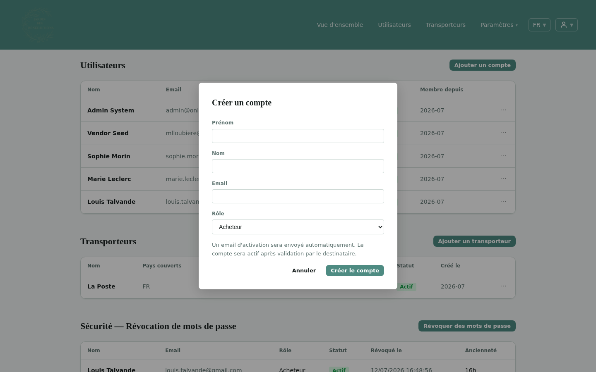

=== Modifier un compte

.Procédure
. Depuis la liste des comptes, cliquez sur *[Modifier]* sur la ligne concernée.
. Modifiez le prénom, le nom, le rôle ou la langue.
. Cliquez sur *Enregistrer*.

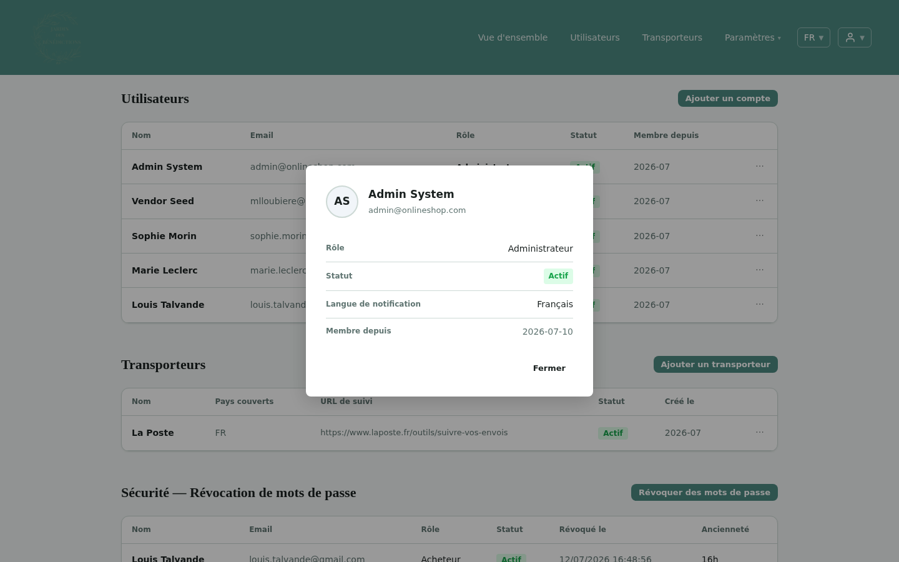

== Gestion des transporteurs

=== Liste des transporteurs

.Procédure
. Cliquez sur *Transporteurs* dans la navigation.
. La liste affiche tous les transporteurs configurés avec leur statut.
. Un transporteur *Inactif* n'apparaît pas dans le tunnel d'achat acheteur.

NOTE: La désactivation d'un transporteur ne supprime pas les expéditions existantes qui le référencent.

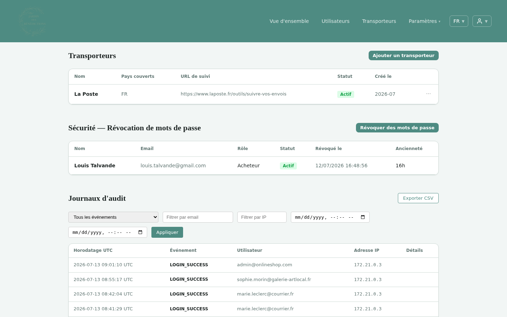

=== Ajouter ou modifier un transporteur

.Procédure
. Cliquez sur *+ Ajouter un transporteur* (ou *[Modifier]* sur un transporteur existant).
. Renseignez le nom et l'URL de suivi (lien vers le site de suivi du transporteur).
. Cochez les pays de la zone euro couverts.
. Définissez le statut *Actif* ou *Inactif*.
. Cliquez sur *Enregistrer*.

NOTE: L'URL de suivi est un lien sortant affiché à l'acheteur — la plateforme ne communique pas avec l'API du transporteur.

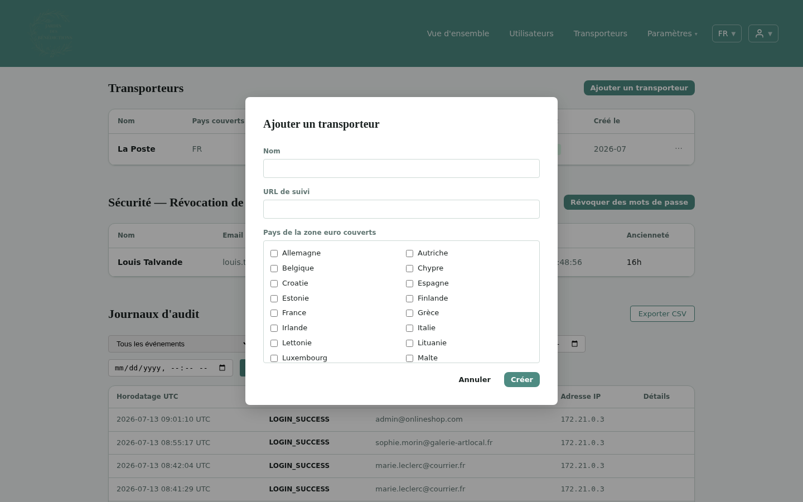

== Mode maintenance

Le mode maintenance désactive l'accès au portail acheteur pour effectuer des opérations techniques.
Les vendeurs et les administrateurs conservent leur accès pendant la maintenance.

.Procédure — Activer la maintenance
. Dans la console, cliquez sur *Maintenance*.
. Basculez le toggle sur *Activé*.
. Personnalisez le message affiché aux visiteurs si nécessaire.
. Cliquez sur *Enregistrer les modifications*.

.Procédure — Désactiver la maintenance
. Retournez sur *Maintenance*.
. Basculez le toggle sur *Désactivé*.
. Cliquez sur *Enregistrer les modifications*.

WARNING: La désactivation est immédiate et rend le portail acheteur de nouveau accessible. Assurez-vous que les travaux sont entièrement terminés avant de désactiver.

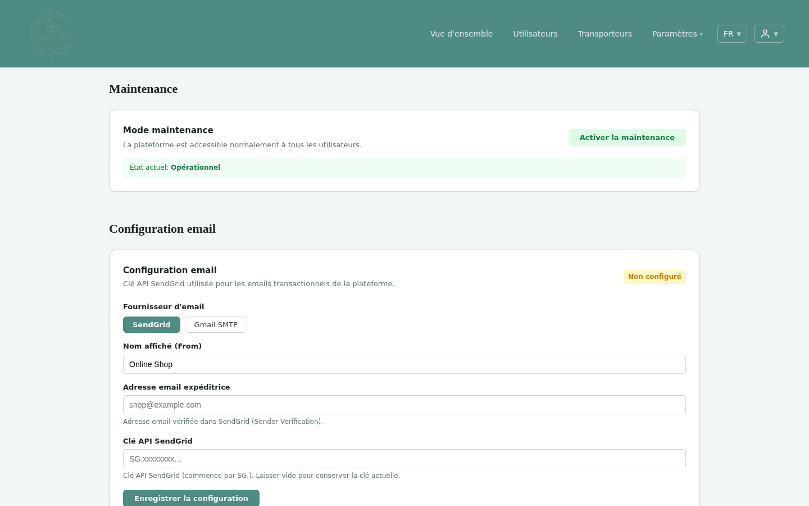

== Mon profil administrateur

=== Informations personnelles

.Procédure
. Cliquez sur votre photo de profil dans la barre de navigation, puis sur *Configuration*.
. L'onglet *Mon profil* affiche votre prénom, nom et email (en lecture seule).
. Modifiez votre numéro de téléphone ou la langue d'interface.
. Cliquez sur *Enregistrer les modifications*.

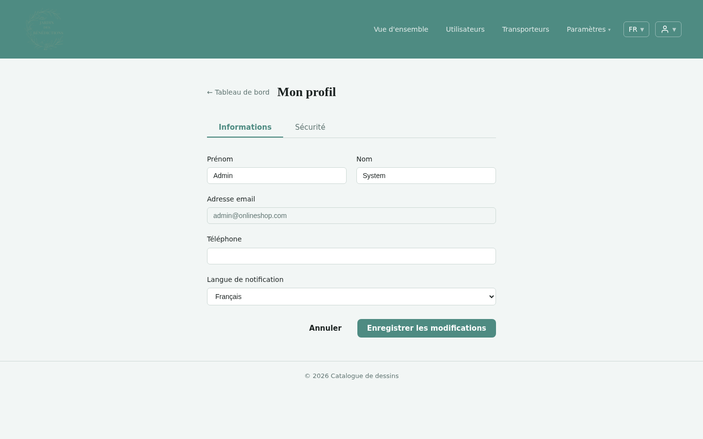

=== Sécurité — Changer de mot de passe

.Procédure
. Depuis votre profil, cliquez sur l'onglet *Sécurité*.
. Saisissez votre mot de passe actuel, puis le nouveau mot de passe deux fois.
. Cliquez sur *Changer le mot de passe*.

NOTE: Le nouveau mot de passe doit contenir au minimum 12 caractères, dont une majuscule, un chiffre et un caractère spécial.

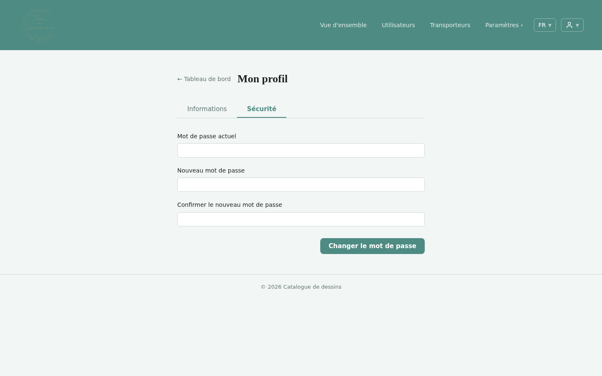

== Configuration email

L'administrateur configure le fournisseur d'email utilisé pour les notifications transactionnelles (confirmations de commande, expéditions, réinitialisations de mot de passe, etc.).
Deux fournisseurs sont disponibles : *SendGrid* et *Gmail SMTP*.
Le passage de l'un à l'autre est immédiat, sans redémarrage du serveur.

=== Choisir le fournisseur

. Dans la barre de navigation, cliquez sur *Email*.
. Dans la section *Fournisseur d'email*, sélectionnez *SendGrid* ou *Gmail SMTP*.
  Les champs affichés changent selon le fournisseur choisi.

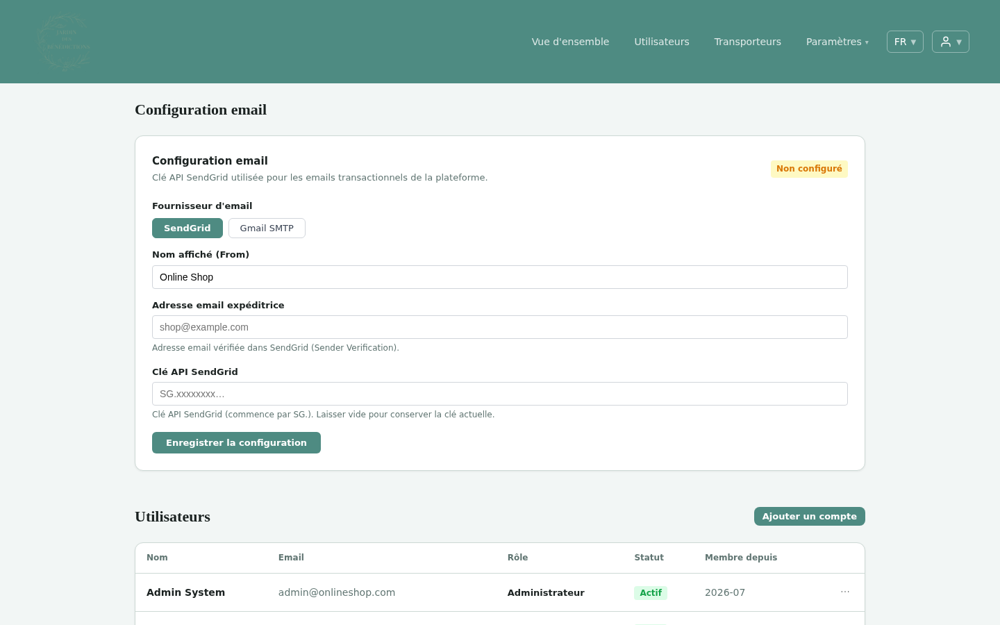

=== Configurer SendGrid

.Procédure
. Sélectionnez *SendGrid* dans le toggle *Fournisseur d'email*.
. Renseignez le *nom affiché* (champ From) visible par les destinataires (ex. « Galerie ArtLocal »).
. Renseignez l'*adresse email expéditrice* — elle doit être vérifiée dans SendGrid via *Sender Verification*.
. Saisissez la *clé API SendGrid* (commence par `SG.`).
  Laissez le champ vide pour conserver la clé déjà enregistrée.
. Cliquez sur *Enregistrer la configuration*.

NOTE: La clé API SendGrid se génère dans le tableau de bord SendGrid sous *Settings → API Keys*. Utilisez une clé avec la permission *Mail Send* uniquement (principe du moindre privilège).

=== Configurer Gmail SMTP

.Procédure
. Sélectionnez *Gmail SMTP* dans le toggle *Fournisseur d'email*.
. Renseignez le *nom affiché* (champ From) visible par les destinataires.
. Vérifiez ou modifiez le *serveur SMTP* (par défaut `smtp.gmail.com`) et le *port* (par défaut `587`).
. Saisissez votre *adresse Gmail* — elle sera également utilisée comme adresse expéditrice.
. Saisissez le *mot de passe d'application* généré dans votre compte Google.
  Laissez le champ vide pour conserver le mot de passe déjà enregistré.
. Cliquez sur *Enregistrer la configuration*.

NOTE: Le mot de passe d'application se génère dans votre compte Google sous *Sécurité → Mots de passe des applications* (authentification à deux facteurs obligatoire). Il est au format `xxxx xxxx xxxx xxxx`.

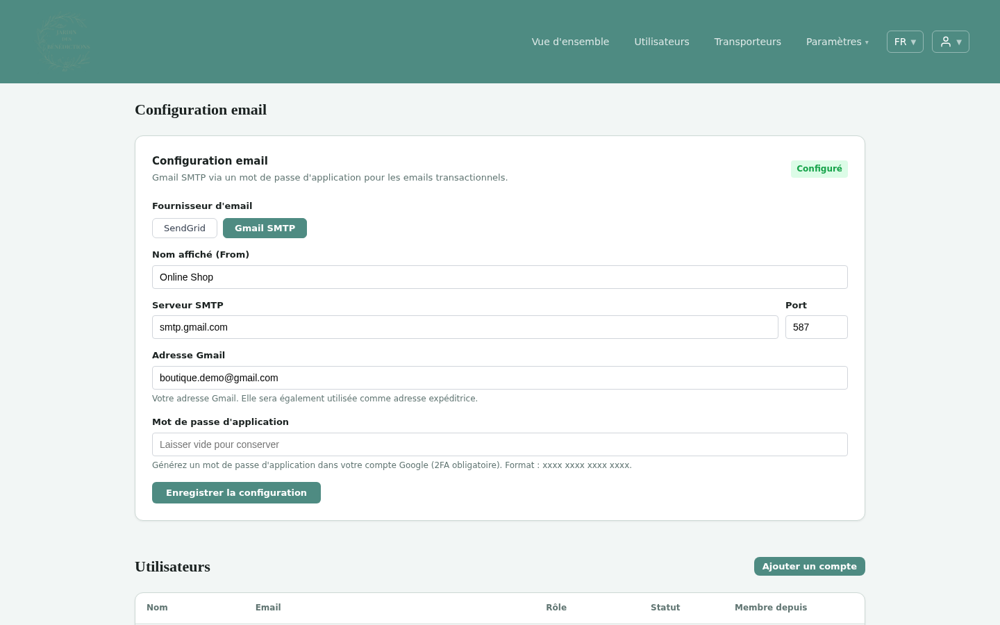

WARNING: N'utilisez pas votre mot de passe Google habituel — créez un mot de passe d'application dédié.

TIP: Une fois la configuration enregistrée, le badge *Configuré* apparaît à côté du titre de la section.

== Sécurité — Révocation de mots de passe

La révocation force la déconnexion immédiate de tous les comptes ciblés et invalide leurs sessions actives.

.Procédure — Révoquer par rôle
. Dans la console, cliquez sur *Sécurité*.
. Dans la section *Révocation par rôle*, sélectionnez le rôle cible (*Acheteurs*, *Vendeurs* ou *Administrateurs*).
. Cliquez sur *Révoquer*.
. Confirmez l'opération dans la boîte de dialogue.

.Procédure — Révoquer des comptes individuels
. Dans la section *Révocation individuelle*, recherchez un compte par nom ou par email dans le champ de recherche.
. Cochez la case de chaque compte à révoquer ; un compteur affiche le nombre de comptes sélectionnés. Vous pouvez trier la liste (*A → Z* / *Z → A*) tout en continuant votre recherche — les comptes cochés restent toujours affichés en haut de la liste, quel que soit le tri, pour rester visibles pendant la sélection.
. Cliquez sur *Révoquer*.

WARNING: La révocation est immédiate et irréversible pour la session en cours. Les utilisateurs devront se reconnecter et redéfinir leur mot de passe.

image::screenshots/admin-securite.png[admin-securite, 1200]

== Journal d'audit

Le journal d'audit enregistre toutes les actions sensibles effectuées sur la plateforme (connexions, modifications de comptes, révocations, changements de configuration).

.Procédure
. Dans la console, cliquez sur *Journal d'audit*.
. Utilisez les filtres *Type d'événement*, *Email*, *Adresse IP* et *Période* pour affiner l'affichage.
. Cliquez sur *Appliquer* pour mettre à jour les résultats.
. Naviguez entre les pages avec les boutons de pagination.
. Cliquez sur *Exporter en CSV* pour télécharger le journal filtré.

NOTE: Le journal est en lecture seule — aucune entrée ne peut être modifiée ou supprimée.

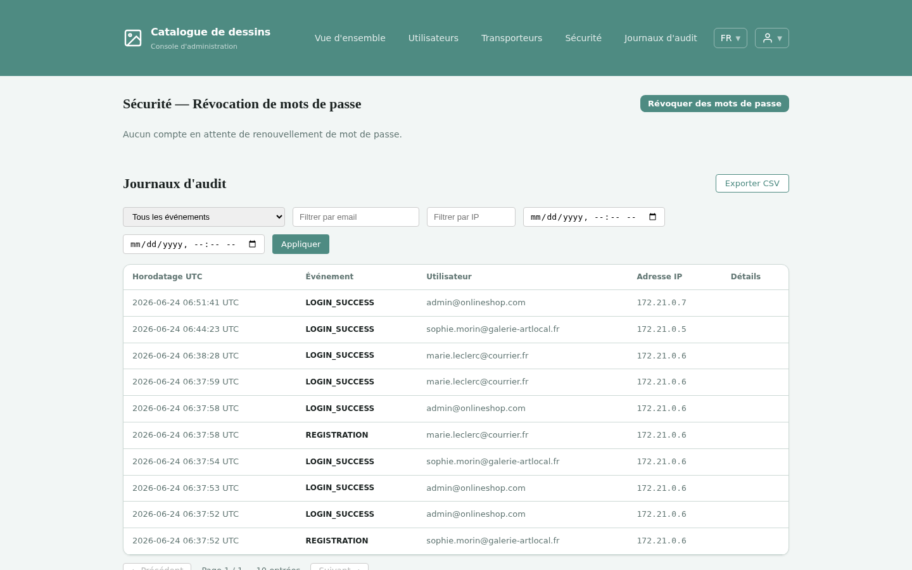

